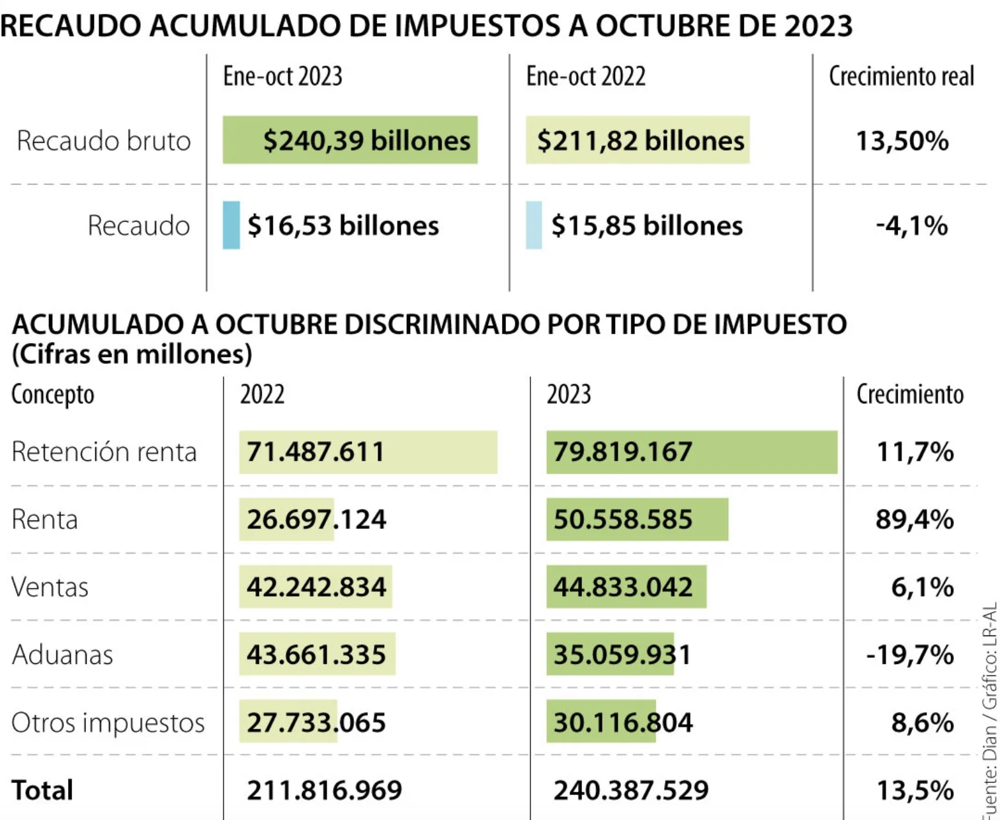

```{r setup, include=FALSE}
options(htmltools.dir.version = FALSE)
```

```{r packages, include=FALSE}
library(pacman)
p_load(broom, latex2exp, ggplot2, ggthemes, ggforce, viridis, dplyr, magrittr, knitr, parallel, flextable, xaringanExtra, tidyverse, emo, fontawesome, datos, babynames, treemapify, shiny, kableExtra, plotly, econocharts, hrbrthemes, DiagrammeR, countdown, readxl, janitor, gapminder, Ecdat, wooldridge, dslabs, extrafont)

# Define colors
red_pink <- "#e64173"
met_slate <- "#272822" # metropolis font color 
purple <- "#9370DB"
green <- "#007935"
light_green <- "#7DBA97"
orange <- "#FD5F00"
turquoise <- "#44C1C4"
# Notes directory
dir_cap<- "~/Users/carlosandresyanesguerra/Documents/Trabajo en R/Con Mac/HealthEconomics/economicsofhealth"
# Knitr options
opts_chunk$set(
  comment = "#>",
  fig.align = "center",
  fig.height = 7,
  fig.width = 10.5,
  #dpi = 300,
  #cache = T,
  warning = F,
  message = F
)  
theme_simple <- theme_bw() + theme(
  axis.line = element_line(color = met_slate),
  panel.grid = element_blank(),
  rect = element_blank(),
  strip.text = element_blank(),
  text = element_text(family = "Fira Sans", color = met_slate, size = 17),
  axis.text.x = element_text(size = 12),
  axis.text.y = element_text(size = 12),
  axis.ticks = element_blank()
)
theme_gif <- theme_bw() + theme(
  axis.line = element_line(color = met_slate),
  panel.grid = element_blank(),
  rect = element_blank(),
  text = element_text(family = "Fira Sans", color = met_slate, size = 17),
  axis.text.x = element_text(size = 12),
  axis.text.y = element_text(size = 12),
  axis.ticks = element_blank()
)
wrapper <- function(x, ...) paste(strwrap(x, ...), collapse = "\n")
```


class: title-slide, center, middle

<span class="fa-stack fa-4x">
  <i class="fa fa-circle fa-stack-2x" style="color: #ffffffcc;"></i>
  <strong class="fa-stack-1x" style="color:#3b4245;">02</strong>
</span> 

# `r rmarkdown::metadata$title`

## `r rmarkdown::metadata$subtitle`

### `r rmarkdown::metadata$author` &#183; Data science

#### [https://carlosyanes.netlify.app/](https://carlosyanes.netlify.app/)
---
class: inverse, middle, center
background-image: url(https://upload.wikimedia.org/wikipedia/commons/a/a0/Academia.edu_logo.svg)
background-size: contain

# Preguntas sesión anterior? 🤚 

---
background-size: 100%
background-image: url(https://media.giphy.com/media/JOXWsgDlyEURl6rgIh/giphy.gif)

???

Image test. Taken from gyfty.

---
class: middle, center

| Hora          | Actividad                               |
|:--------------|:----------------------------------------|
| 08:00 - 08:10 | Preguntas o aclaración                  |
| 08:10 - 09:30 | Sesión 2 Generalidades del Sistema      |
| 09:30 - 10:05 | *Break* `r emo::ji("coffee")`           |
| 10:05 - 10:25 | Preguntas 1.                            |
| 10:25 - 11:30 | Control de lectura tareas               |

---
layout: true

<div class="my-footer"><span>Economía de la Salud | CAYG | www.uninorte.edu.co </span></div>

---
# Para hoy... intentamos aprender

--

1. Conocer de la productividad en medicina

--

1. Algunos datos del estado

--

1. Importancia de la información en Salud

---


```{r jk12, echo=FALSE, fig.height=3, fig.width=1}

```

---
# Top 10 de sistemas de salud según OMS

--

1. Francia
2. .RRed[Italia]
3. San Marino
4. .RRed[Andorra]
5. Malta
6. .RRed[Singapur]
7. España
8. .RRed[Omán]
9. Austria
10. .RRed[Japón]

---
# Top 10 de sistemas de salud según otros 

--

1. Corea del Sur
2. .RRed[Taiwan]
3. Dinamarca
4. .RRed[Austria]
5. Japón
6. .RRed[Australia]
7. Francia
8. .RRed[España]
9. Belgica
10. .RRed[Inglaterra]

---
class: live-code

# Pero que tienen esos sistemas?...

--

La calidad de la asistencia sanitaria se determina teniendo en cuenta un amplio abanico de factores, como:

--

+ **Proceso asistencial** (medidas de atención preventiva, atención segura, atención coordinada y compromiso y preferencias del paciente)

--

+ **Acceso** (asequibilidad y puntualidad)

--

+ **Eficiencia administrativa**, la equidad y los resultados de la asistencia sanitaria (salud de la población, mortalidad susceptible de atención sanitaria resultados de salud específicos de la enfermedad).

---
class: live-code

# Pero que tienen esos sistemas?...

--

**Francia** ocupa frecuentemente el primer lugar en rankings globales. Su sistema combina un enfoque universal con un seguro de salud financiado por contribuciones públicas y privadas. Además, la atención preventiva y los servicios especializados son accesibles para todos los ciudadanos.

--

**Sistema Universal**: Francia ofrece un sistema de salud universal financiado por .RRed[impuestos] y cotizaciones sociales, conocido como "Sécurité Sociale". Este sistema cubre a casi todos los residentes con seguro de salud.

--

**Calidad del Cuidado**: Es conocido por su alta calidad de atención médica, con acceso a médicos especialistas, .RRed[hospitales modernos], y un enfoque en la prevención y el tratamiento temprano de enfermedades.

---
# Pero que tienen esos sistemas?...

--

**Libertad de Elección**: Los pacientes tienen una amplia libertad para elegir a sus médicos, ya sea en el sector público o privado. Sin embargo, hay un sistema de lista de médicos asignados (médecin traitant) para mejorar la continuidad de la atención.

--

**Costos para el Paciente**: Aunque la mayoría de los servicios están cubiertos, los pacientes suelen tener que pagar una parte del costo (ticket moderateur) que puede ser reembolsado parcialmente o totalmente dependiendo de la cobertura adicional (mutuelles) que tengan.

--

**Innovación y Educación**: Francia es líder en investigación médica y educación, con numerosas instituciones que contribuyen a avances en el campo de la salud.

--

**Desafíos**: A pesar de sus fortalezas, el sistema francés enfrenta retos como el _envejecimiento_ de la población, el aumento de los costos de la atención médica, y la necesidad de reformas para mantener su sostenibilidad y eficiencia.

---
# Pero que tienen esos sistemas?...

--

### Taiwan

--

**Sistema de Salud Universal**: Taiwán implementó su Sistema Nacional de Seguro de Salud (NHI - National Health Insurance) en 1995, ofreciendo .RRed[cobertura universal] a todos los ciudadanos y residentes legales. Este es un sistema de pago único, donde el **gobierno** gestiona y financia la mayor parte del cuidado de la salud.

--

**Accesibilidad y Eficiencia**: El sistema taiwanés es conocido por su accesibilidad, con tiempos de espera cortos para consultas y tratamientos, y copagos relativamente bajos para los pacientes. La eficiencia del sistema también se refleja en la capacidad de manejar grandes volúmenes de pacientes sin comprometer la calidad del servicio.

--

**Innovación en Tecnología Médica**: Taiwán ha sido pionero en la digitalización de la salud con su .RRed[sistema de tarjetas de salud electrónicas], que almacenan _información médica_ de los pacientes, permitiendo un acceso rápido a los registros médicos en cualquier parte del país. Este sistema ha jugado un papel crucial en la gestión de la pandemia de COVID-19.


---
class: inverse, middle, center
background-image: url(https://upload.wikimedia.org/wikipedia/commons/e/e8/The_movie_doctor%2C_by_G._Francis_Kauffman.svg)
background-size: contain

### Hablemos de productividad 🇨🇴 

---
# Productividad

--

<md-blockquote>Capacidad de .RRed[producir] algo. Para el caso de los profesionales de salud, puede ser mucho mas amplia. Por ejemplo, se pueden producir consultas, cirugías, exámenes diagnósticos, planes de tratamiento, artículos publicados, residentes entrenados, etc.</md-blockquote>

--

<font size="+8">"El espectro es muy amplio"</font>

--

`r fa("home", fill="red")` Medir la productividad en servicios como el médico o como en la docencia es **difícil** y en muchos casos hasta compleja.

--

`r fa("home", fill="red")` En el sentido *económico* va en línea en la cantidad de tiempo o recursos que se han .RRed[consumido] para producir un **bien/servicio**.

---
# Productividad

--

`r fa("mug-hot", fill="red")` Podemos hacer la primera aproximación a:

$$P=\dfrac{\text{Producción}}{\text{Recursos}}$$

--

*En la parte de recursos, se hace referencia a (tiempo o dinero).*

--

`r fa("bell", fill="blue")` En Colombia siempre se ha relacionado con el asunto de los honorarios

--

`r fa("bell", fill="blue")` Con la demanda represada (acceso/cobertura) la formula se ha tenido que modificar.

--

> Recuerde que el negocio perfecto del asegurador: recibir la UPC de un afiliado sano y que con el tiempo se mantenga así.

---
# Productividad

--

`r fa("info-circle", fill="red")` El ratio de la formula de productividad viene a rondar entonces:

$$P=\dfrac{\text{Producción}}{\text{Tiempo}}$$

--

`r fa("bell", fill="blue")` Regla de 3 pacientes por hora (- _ojalá y fueran 4!!_ -) 😮, Ahh que tal?

--

`r fa("bell", fill="blue")` Con la formula original, para aumentar la productividad usted debía reducir el uso de medicamentos, exámenes diagnósticos, remisiones, etc.

--

`r fa("bell", fill="blue")` La productividad se volvería perfecta si el 80% de sus pacientes se lleva una formula de acetaminofen por 12 tab y de 500 mg y desde luego si logró atender de a 4 pacientes por hora.

---
# Productividad

--

`r fa("heart", fill="red")` La American Academy of Family Physician y otros gremios de los EEUU, han venido discutiendo las relaciones de productividad, ya que no permiten hacer comparaciones entre médicos. Algunas demandan mayor cantidad de tiempo. Pe: no es lo mismo un adolescente que acude a consulta con un problema de acné que un paciente con obesidad y tiene " _dolores frecuentes en el pecho_ ".

--

La medida actual va en el mótivo de **UVR (unidad de valor relativo)**. Para el caso de la consulta por acné esta es de 1 UVR y en cambio el paciente con posible dolor precordial se le da la ponderación de 3 UVR. 

--

EL UVR trata de incluir:

+ Tiempo requerido en consulta
+ Habilidades técnicas y esfuerzo
+ Esfuerzo mental
+ Estres asociado a riesgos iatrogénicos


---
# Productividad

--

`r fa("sketch", fill="blue")` Consideraciones hacia la mejora:

--

+ Hacer uso de la tecnología para reducir costos
+ Asignaciones de población a grupos médicos 


---
class: inverse, middle, center
background-image: url(https://upload.wikimedia.org/wikipedia/commons/3/35/The_National_Capitol_of_the_Republic_of_Colombia_seen_from_the_famed_gardens_of_the_Plaza_de_Armas.png)
background-size: contain

### Hablemos del Estado


---
# Por qué es tan importante el Estado?

--

+ Nacemos en hospitales subvencionados por el estado. 

--

+ Se hacen registros civiles (brindan una serie de privilegios y obligaciones) como ciudadanos.

--

+ Muchos de nosotros estudiamos en universidades y colegios públicos.

--

+ Pagamos impuestos 

--

+ Consumimos bienes que son del estado (Parques, vías nacionales, etc)

--

+ Se hace y nace la estructura jurídica

--

+ Genera empleos (directa como indirectamente)

--

+ Hace regulaciones


---
# Estado

--

```{r jk13, echo=FALSE, fig.height=2, fig.width=1}
knitr::include_graphics("images/Estestado.png")
```
---
# Estado

--

#### Funciones

--

<font size="+8">Ahorrar.. administrar...controlar</font>

--

`r fa("balance-scale-left")` Facilitador del desarrollo de inversiones.

--

`r fa("balance-scale-left")` Generar mayor competencia.

--

`r fa("balance-scale-left")` Control público

---
# Estado

--

<div align="center">
<font size="+8">511 Billones PGN</font>
</div align="center">

--

..."Repartidos por sectores, los renglones con mayor apropiación para el PGN 2025 son: .RRed[educación], con $70,45 billones; .RRed[salud y protección social], $61,5 billones; defensa y policía, $56,01 billones; Hacienda, $47,3 billones; trabajo, $44,37 billones; Transporte $15,2 billones."... Fuente: DNP.

---
# Estado

--



---
class: middle, inverse,

# Gobernabilidad

#### Ejercicio de autoridad a traves de instituciones para el bien común.

---
# Gasto Público

--


---
# Gasto Público

--

```{R, graph01, echo = F, fig.height = 5, fig.width = 9, dev = "svg"}
# Datos
pop_df = 
  data.frame(
  lang = c("Colombia", "Alemania", "España", "EEUU", "Brasil"),
  n_rate = c(30.2, 27.9, 19.7, 22.7, 36.3),
  free = c(F, T, T, T, F)
  )
## Graficando
pop_df %>% 
  mutate(lang = lang %>% factor(ordered = T)) %>%
  ggplot(aes(x = lang, y = n_rate, fill = free)) +
  geom_col() +
  geom_hline(yintercept = 0) +
  aes(x = reorder(lang, -n_rate), fill = reorder(free, -free)) +
  xlab("Países") +
  scale_y_continuous(label = scales::comma) +
  ylab("Porcentaje (%) del PIB") +
  labs(
    title = "Gasto Público",
    subtitle = "Banco Mundial, 2019/20"
    ) +
  scale_fill_manual(
    "Región Norte",
    labels = c("Si", "No"),
    values = c("#f92672", "darkslategray")
    ) +
  ggthemes::theme_pander(base_size = 17) +
  # theme_ipsum() +
  theme(legend.position = "bottom")
```

---
# Gasto Público

--

```{R, graph02, fig.height=5, fig.width=7, message=FALSE, warning=FALSE, dev="svg", echo=F}
# Datos
data <- data.frame(
  year = c(2010:2023),
  value = c(30.35, 30.23, 29.09, 30, 31.26, 31.28, 29.9, 29.32, 34.66, 32.88, 33.56, 34.51, 35.04, 36.13)
)

# plot
p <- ggplot(data, aes(x=year, y=value)) +
  geom_line( color="darkslategray") + 
  geom_hline(yintercept = 0) +
  labs(
    title = "Evolución del Gasto Público Colombiano",
    subtitle = "Banco Mundial, 2010-2021"
    ) +
  xlab("Años") +
  ylab("Gasto Público como % PIB") +
  ggthemes::theme_pander(base_size = 17)
  #theme_ipsum() +
  #theme(axis.text.x=element_text(angle=60, hjust=1)) 
p

```
---
class: inverse
background-image: url(https://upload.wikimedia.org/wikipedia/commons/3/39/Naruto_Shiki_Fujin.svg)
background-size: contain

# Politica fiscal

.left[<font size="+5">.hi-orange[EXPANSIVA]</font> <br>
Gasto Publico es mayor <br>
Reducción de los impuestos <br>
Menos regulación]

.right[<font size="+5">.hi-orange[CONTRACTIVA]</font> <br>
 Gasto Publico disminuye <br>
 Aumento de los impuestos <br>
 Mas regulación]

---
class: inverse, middle, right
background-image: url(https://upload.wikimedia.org/wikipedia/commons/0/03/New_York_City_%28New_York%2C_USA%29%2C_Empire_State_Building_--_2012_--_6436.jpg)
background-size: cover

<font size="+6">.hi-orange[Nuestro Presupuesto]</font> <br>
<font size="+3">500 Billones de pesos</font> <br>
<font size="+2">.hi-orange[Aprobado por el congreso para 2024]</font> 

---
class: middle

# De donde sale todo ese dinero?

----

---
class: inverse, middle
background-image: url(https://upload.wikimedia.org/wikipedia/commons/e/e2/Yellow_Color.jpg)
background-size: contain
background-position: -8.5cm 50%

.pull-left[
<font size="+7">$204 Billones de pesos</font> <br>
<font size="+3"> .hi-orange[Tributos]</font>
]

.pull-right[
<font size="+7">$60 Billones de pesos</font> <br>
<font size="+3"> .hi-orange[Ingresos Propios]</font>
]
---
# Tributos en Colombia

--

#### Los maneja la DIAN

--

```{R, graph03, fig.height=6, fig.width=8, message=FALSE, warning=FALSE, dev="svg", echo=F}
# Datos
data <- data.frame(
  category=c("IVA", "Renta Naturales", "Renta Juridica", "Patrimonio", "SSS", "Otros", "Otros BBSS"),
  count=c(29, 7, 25, 10, 10, 8, 11)
)

# Compute percentages
#data$fraction <- data$count / sum(data$count)

# Compute the cumulative percentages 
data$ymax <- cumsum(data$count)

# Compute the bottom of each rectangle
data$ymin <- c(0, head(data$ymax, n=-1))

# Compute label position
data$labelPosition <- (data$ymax + data$ymin) / 2


# Compute a good label
data$label <- paste0(data$category, "\n Porcentaje: ", data$count)

# Make the plot
ggplot(data, aes(ymax=ymax, ymin=ymin, xmax=4, xmin=3, fill=category)) +
  geom_rect() +
  geom_label( x=3.5, aes(y=labelPosition, label=label), size=3) +
  scale_fill_brewer(palette=4) +
  coord_polar(theta="y") +
  xlim(c(2, 4)) +
  theme_void() +
  theme(legend.position = "none")
```

---
class: inverse, middle, center
background-image: url(https://upload.wikimedia.org/wikipedia/commons/7/77/Congreso_Colombia.png)
background-size: contain

### Entender nuestra debilidad institucional

---
# Nuestra debilidad

--


---
class: live-code

# Si usted pregunta a las personas...

--

Oye.. Tu vendiste tu voto?

--

Tu evades impuestos?

--

🤬

--

<font size="+5"> No van a decir nunca la verdad!!</font>

---
class: inverse, middle

# Concepto Clave 3

--

#### Deseabilidad Social

---
# Deseabilidad social

--

<font size="+5"> Que tan avergonzado(a) me siento por decir la .blue[verdad] ya que entiendo que no es lo deseable socialmente<font size="+5">

--

`r fa("virus", fill="red")` Y entonces que hacer?

--

`r fa("info-circle")` Hagale la pregunta de esta manera a una persona:  ¿cuantas de estas cosas (no diga cuales)  tiene en cuenta para elegir o votar por alguien?

--

+ Hablando con los amigos
+ Información que escucho del candidato
+ Venta del voto
+ Partido del Candidato
+ Programa de gobierno

---

# Deseabilidad social


<font size="+5"> Que tan avergonzado(a) me siento por decir la .blue[verdad] ya que entiendo que no es lo deseable socialmente<font size="+5">


`r fa("virus", fill="red")` Y entonces que hacer?


`r fa("info-circle")` Hagale la pregunta de esta manera a una persona:  ¿cuantas de estas cosas (no diga cuales)  tiene en cuenta para elegir o votar por alguien?

--

+ Hablando con los amigos
+ Información que escucho del candidato
+ Partido del Candidato
+ Programa de gobierno

---
# Respuestas

--

La media del primer grupo respondió 3.5

--

La media del segundo grupo respondió 3

--

En total, el 50% de los encuestados vendió su voto.

--


<font size="+5"> CLIENTELISMO!! </font size="+5">

---
# Lo díficil de construir estado

--

<font size="+4"> Ciudadanos con regalos, empresas y sectores con gabelas, contratistas amañados
... El estado es regalon!! </font size="+5">

--

`r fa("virus", fill="red")` Como mejorar eso?

--

+ Justicia!!

--

+ Expansión del estado

--

+ Empoderamiento de los movimientos sociales
---
class: your-turn

# <i class="fas fa-cloud"></i>

## Actividad 2: Revisión General

Mire lo siguiente:
<https://www.youtube.com/watch?v=z3xYX5BkPQw>

Que mensaje le deja?

<https://data.worldbank.org/>

<http://www.casagrandecaribe.com.co/images/Salud-para-transformaci%C3%B3n-social-caribe-colombiano.pdf>

<https://www.worldometers.info/>

### Siga los lineamientos del profesor:

```{r echo = FALSE}
countdown(minutes = 50, update_every = 55)
```

---
# Bibliografía

`r fa('book')` Amador, F. (2011). El médico empresario. Equilibrio Gráfico Editorial.

`r fa('book')` Apuntes de Leopoldo Fergusson (2016). Consejo de competitividad.

`r fa('book')` Cabasés, J. M., & Oliva, J. (2011). El gobierno de la sanidad frente a la crisis económica. Notas sobre economía de la salud y sostenibilidad del sistema sanitario. Cuadernos de información económica, 225, 57-62.

`r fa('book')`Phelps, C. E. (2017). Health economics. Routledge.


---
class: your-turn

## Gracias por su atención!

### Alguna pregunta adicional?

#### Carlos Andres Yanes Guerra
`r fa("envelope", fill="red")` cayanes@uninorte.edu.co
`r fa("twitter", fill="cyan")` keynes37


