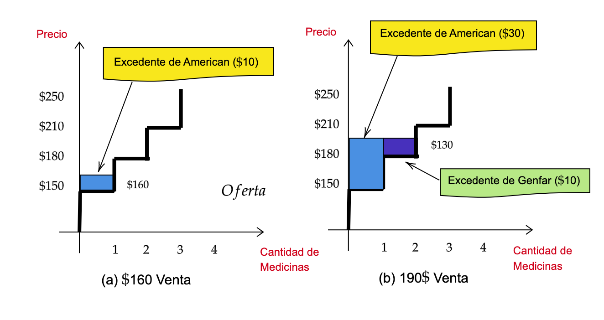

```{r setup, include=FALSE}
options(htmltools.dir.version = FALSE)
library(pacman)
p_load(ggthemes, readxl, viridis, knitr, dslabs, gapminder, extrafont, Ecdat, wooldridge, tidyverse, magrittr, janitor, kableExtra, countdown, ymlthis, fontawesome, babynames, flextable, DiagrammeR, hrbrthemes, econocharts, plotly)
# Colores
red_pink <- "#e64173"
met_slate <- "#272822" # metropolis font color 
purple <- "#9370DB"
green <- "#007935"
light_green <- "#7DBA97"
orange <- "#FD5F00"
turquoise <- "#44C1C4"
red <- "#b92e34"
# Knitr opciones
opts_chunk$set(
  comment = "#>",
  fig.align = "center",
  fig.height = 7,
  fig.width = 10.5,
  #dpi = 300,
  #cache = T,
  warning = F,
  message = F
)  
theme_simple <- theme_bw() + theme(
  axis.line = element_line(color = met_slate),
  panel.grid = element_blank(),
  rect = element_blank(),
  strip.text = element_blank(),
  text = element_text(family = "Fira Sans", color = met_slate, size = 17),
  axis.text.x = element_text(size = 12),
  axis.text.y = element_text(size = 12),
  axis.ticks = element_blank()
)
theme_market <- theme_bw() + theme(
  axis.line = element_line(color = met_slate),
  panel.grid = element_blank(),
  rect = element_blank(),
  strip.text = element_blank(),
  text = element_text(family = "Fira Sans", color = met_slate, size = 17),
  axis.title.x = element_text(hjust = 1, size = 17),
  axis.title.y = element_text(hjust = 1, angle = 0, size = 17),
  axis.ticks = element_blank()
)
theme_gif <- theme_bw() + theme(
  axis.line = element_line(color = met_slate),
  panel.grid = element_blank(),
  rect = element_blank(),
  text = element_text(family = "Fira Sans", color = met_slate, size = 17),
  axis.text.x = element_text(size = 12),
  axis.text.y = element_text(size = 12),
  axis.ticks = element_blank()
)
wrapper <- function(x, ...) paste(strwrap(x, ...), collapse = "\n")
ggplot2::theme_set(ggplot2::theme_minimal())
```


class: title-slide, center, middle

<span class="fa-stack fa-4x">
  <i class="fa fa-circle fa-stack-2x" style="color: #ffffffcc;"></i>
  <strong class="fa-stack-1x" style="color:#3b4245;">`r rmarkdown::metadata$session`</strong>
</span> 

# `r rmarkdown::metadata$title`

## `r rmarkdown::metadata$subtitle`

### `r rmarkdown::metadata$author` &#183; IEEC

#### [Departamento de Economía](https://www.uninorte.edu.co/web/departamento-de-economia)

---
class: inverse, middle, center
background-image: url(https://upload.wikimedia.org/wikipedia/commons/2/26/World_Health_Organization_Logo.svg)
background-size: contain

# Preguntas sesión anterior? 🤚

---
background-size: 100%
background-image: url(https://media.giphy.com/media/SRq0sHzd4Qa8BbIDol/giphy.gif)

???

Image test. Taken from gyfty.
 
---
class: middle, center

| Hora          | Actividad                               |
|:--------------|:----------------------------------------|
| 14:30 - 14:50 | Preguntas sesión                        |
| 14:50 - 16:45 | Conceptos de demanda                    |
| 16:45 - 17:05 | *Break* `r emo::ji("coffee")`           |
| 17:05 - 17:30 | Comentarios                             |
| 17:30 - 18:15 | Sesión 7 (Comentarios de Regulación)    |

---
layout: true

<div class="my-footer"><span>Economía de la Salud | CAYG | www.uninorte.edu.co </span></div>

---
# Para hoy... intentamos aprender

--

1. Demanda por productos de salud

--

1. Relación Precio-Consumo

--

1. Se paga demasiado por salud?

--

1. Discusión de aquellos factores que afectan la demanda de servicios de salud

---
# Demanda

--

<md-blockquote> Aquella cantidad de productos que compramos a distintos precios permaneciendo todo lo demás constante</md-blockquote>

--

En economía, el consumo se denota como .blue[demanda]. depende regularmente de variables como el *precio*, el *ingreso* de las personas, del *precio de otros bienes* (complementarios y/o sustitutos), *gustos* de los consumidores, entre otros factores.

--

La demanda regularmente es una .blue[representación], de las intenciones de los consumidores y tambien depende del tipo de bien con que se negocia en el .RRed[mercado].

---
# Demanda

--

### Determinantes

--

**P:** Qué determina la demanda de mercado.super[.pink[<span>&#8224;</span>]] para un producto particular?

.footnote[.pink[<span>&#8224;</span>]: *Demanda* .mono[=] La relación entre el *precio* y la *cantidad demandada.*]

--

- Ingreso o bienestar.

- Precios de los bienes y servicios.

- Expectativas sobre precios futuros.

- Desastres naturales.

- Parte demográfica, tiempo de desplazamiento.

- Calidad, públicidad, costo de mantenimiento del bien, legalizaciones, *etc.*

---
# Demanda en salud

--

*Primero:* Hay que aclarar que desde luego existe una diferencia entre la necesidad de .RRed[atención médica] y la .blue[demanda por servicios de salud]

--

<md-blockquote> La demanda por servicios de salud viene a ser ese requerimiento que depende de factores como el ingreso, los costos de atención y el estado de salud percibido por las personas o la gravedad percibida del problema de salud. .bbrown[*Ayala(2014) citando a Musgrove (1985) y Gallego (2008)*] </md-blockquote>

--

.grey[Ejemplo:] "*A modo de ilustración, si cinco de diez personas presentaron un problema de salud, entonces se habla de un 50% de necesidad de atención médica (5/10), y si tres de estas personas acudieron a un centro médico para atender su necesidad, hablamos de un 60% de la demanda de salud (3/5)*" Ayala (2014). 


---
# Qué demandan los Colombianos?

--

```{r, gr1, echo=FALSE}
# Base de datos
library(readxl)
datos1 <- read_excel("datos1.xlsx")
data = datos1 %>% arrange(tipo, elemento, valor)
require(ggplot2)
require(moonBook)
require(webr)
PieDonut(data,aes(pies=tipo,donuts=elemento, count=valor))
```

---
.pull-left[

# Demanda

| Precio | Demanda |
|--------|---------|
| $ 8    | 1       |
| $ 5    | 2.7     |
| $ 2.5  | 6       |
| $ 1.5  | 9       |

+ Note que en la medida que el precio (.RRed[disminuye]) las cantidades aumentan
]

--

.pull-right[

```{r, demand, echo=FALSE}
p <- indifference(ncurves = 1, x = c(2, 4), linecol = 3, main = "Curva de la demanda", xlab = "Cantidad X", ylab = "Precio")
p$p
```

]

---
.pull-left[

# Demanda

- En otros momentos tendremos *desplazamiento* hacia $(\uparrow)$ o hacia $(\downarrow)$ en el mapa de curvas.


- Esos .RRed[casos] ocurren cuando otra variable distinta al .blue[precio] 💰 influye en el mercado.]

--

.pull-right[

```{r, demand2, echo=FALSE}
p <- indifference(ncurves = 2, x = c(2, 4), linecol = 3, main = "Desplazamiento demanda", xlab = "Cantidad X", ylab = "Precio")

int <- bind_rows(curve_intersect(data.frame(x = 1:1000, y = rep(3, nrow(p$curve))), p$curve + 1))

p$p + geom_segment(data = int, aes(x = 0, y = y, xend = x, yend = y), lty = "dotted")  +
      geom_segment(data = int, aes(x = x, y = 0, xend = x, yend = y), lty = "dotted") +
      geom_point(data = int, size = 3)
```

]

---
class: inverse, middle, center
background-image: url(https://upload.wikimedia.org/wikipedia/commons/2/26/World_Health_Organization_Logo.svg)
background-size: contain

# Qué ocurre con la oferta? ⛑

---
.pull-left[
# Oferta

| Precio | Oferta |
|--------|---------|
| $ 8    | 11       |
| $ 5    | 7.5     |
| $ 2.5  | 6       |
| $ 1.5  | 1.4       |

- Note que en la medida que el precio (.RUred[aumenta]) las cantidades *ofrecidas* aumentan]

--

.pull-right[
```{r, Supply1, echo=FALSE, message=FALSE}
s<-supply(ncurves = 1,      # Number of supply curves to be plotted
      type = "line",         # Type of the curve
      x = c(2, 4, 8),        # Y-axis values where to create intersections
      linecol = 2,           # Color of the curves
      geom = "label",        # Label type of the intersection points
      geomfill = "red",     # If geom = "label", is the background color of the label
      main = "Curva de oferta") # Title of the plot

s$p
```
]
---
class: inverse, middle, center
background-image: url(https://upload.wikimedia.org/wikipedia/commons/2/26/World_Health_Organization_Logo.svg)
background-size: contain

# Cambios en la demanda

---
.more-left[
# Cambios en la demanda
```{r, echo = FALSE, fig.height = 5, fig.width = 5, dev = "svg"}
x <- 0:10
demand <- function(x) 10 - x
demand_2 <- function(x) 12 - x
supply <- function(x) 1 + x
q_1 <- uniroot(function(x) demand(x) - supply(x), range(x))$root
p_1 <- demand(q_1)
q_2 <- uniroot(function(x) demand_2(x) - supply(x), range(x))$root
p_2 <- demand_2(q_2)
base <- ggplot(data = data.frame(x = 0), mapping = aes(x = x)) +
  scale_x_continuous(limits = c(0, 10.5), expand = c(0, 0), breaks = c(q_1), labels = c(expression(Q^"*"))) +
  scale_y_continuous(limits = c(0, 10.5), expand = c(0, 0), breaks = c(p_1), labels = c(expression(P^"*"))) +
  theme_market +
  labs(x = "Q", y = "P") +
  stat_function(fun = demand, color = red_pink, size = 1) +
  stat_function(fun = supply, color = purple, size = 1) +
  geom_point(x = q_1, y = p_1, color = met_slate, size = 2) +
  #geom_point(x = q_2, y = p_2, color = met_slate, size = 2) +
  geom_segment(x = 0, xend = q_1, y = p_1, yend = p_1, color = met_slate, linetype = "dashed", size = 1) +
  #geom_segment(x = 0, xend = q_2, y = p_2, yend = p_2, color = met_slate, linetype = "dashed", size = 1) +
  geom_segment(x = q_1, xend = q_1, y = 0, yend = p_1, color = met_slate, linetype = "dashed", size = 1) +
  #geom_segment(x = q_2, xend = q_2, y = 0, yend = p_2, color = met_slate, linetype = "dashed", size = 1) +
  annotate("text", label = expression(D[1]), x = 10, y = 0.65, color = red_pink, family = "Fira Sans", size = 9) +
  annotate("text", label = "S", x = 9.2, y = 9.65, color = purple, family = "Fira Sans", size = 9)
base
```
]

.less-right[
### .pink[Incremento en la Demanda]

A cualquier precio, los consumidores están dispuestos y son capaces de comprar más unidades que antes.

La cantidad de equilibrio **aumenta**.

El precio de equilibrio **aumenta**.

]

---
.more-left[
# Cambios en la demanda
```{r, echo = FALSE, fig.height = 5, fig.width = 5, dev = "svg"}
x <- 0:10
demand <- function(x) 10 - x
demand_2 <- function(x) 12 - x
supply <- function(x) 1 + x
q_1 <- uniroot(function(x) demand(x) - supply(x), range(x))$root
p_1 <- demand(q_1)
q_2 <- uniroot(function(x) demand_2(x) - supply(x), range(x))$root
p_2 <- demand_2(q_2)
demand_increase <- ggplot(data = data.frame(x = 0), mapping = aes(x = x)) +
  scale_x_continuous(limits = c(0, 10.5), expand = c(0, 0), breaks = c(q_2), labels = c(expression(Q^"*"))) +
  scale_y_continuous(limits = c(0, 10.5), expand = c(0, 0), breaks = c(p_2), labels = c(expression(P^"*"))) +
  theme_market +
  labs(x = "Q", y = "P") +
  stat_function(fun = demand, color = red_pink, size = 1, alpha = 0.5) +
  stat_function(fun = demand_2, color = red_pink, size = 1) +
  stat_function(fun = supply, color = purple, size = 1) +
  geom_point(x = q_1, y = p_1, color = met_slate, size = 2, alpha = 0.5) +
  geom_point(x = q_2, y = p_2, color = met_slate, size = 2) +
  geom_segment(x = 0, xend = q_1, y = p_1, yend = p_1, color = met_slate, linetype = "dashed", size = 1, alpha = 0.5) +
  geom_segment(x = 0, xend = q_2, y = p_2, yend = p_2, color = met_slate, linetype = "dashed", size = 1) +
  geom_segment(x = q_1, xend = q_1, y = 0, yend = p_1, color = met_slate, linetype = "dashed", size = 1, alpha = 0.5) +
  geom_segment(x = q_2, xend = q_2, y = 0, yend = p_2, color = met_slate, linetype = "dashed", size = 1) +
  geom_segment(aes(x = 6 + 0.2, y = 4, xend = 8 - 0.2, yend = 4), arrow = arrow(angle = 20, length = unit(0.4,"cm"), type = "closed"), color = met_slate, size = 1) + 
  annotate("text", label = expression(D[1]), x = 10, y = 0.65, color = red_pink, family = "Fira Sans", size = 9, alpha = 0.5) +
  annotate("text", label = expression(D[2]), x = 10, y = 2.65, color = red_pink, family = "Fira Sans", size = 9) +
  annotate("text", label = "S", x = 9.2, y = 9.65, color = purple, family = "Fira Sans", size = 9)
demand_increase
```
]

.less-right[
### .pink[Incremento en la Demanda]

A cualquier precio, los consumidores están dispuestos y son capaces de comprar más unidades que antes.

La cantidad de equilibrio **aumenta**.

El precio de equilibrio **aumenta**.

]

---
.more-left[
# Cambios en la demanda
```{r, echo = FALSE, fig.height = 5, fig.width = 5, dev = "svg"}
base
```
]

.less-right[
### .pink[Disminución en la Demanda]

A cualquier precio, los consumidores están dispuestos y son capaces de comprar menos unidades que antes.

La cantidad de equilibrio **disminuye**.

El precio de equilibrio **disminuye**.


]

---
.more-left[
# Cambios en la demanda
```{r, echo = FALSE, fig.height = 5, fig.width = 5, dev = "svg"}
x <- 0:10
demand <- function(x) 10 - x
demand_2 <- function(x) 8 - x
supply <- function(x) 1 + x
q_1 <- uniroot(function(x) demand(x) - supply(x), range(x))$root
p_1 <- demand(q_1)
q_2 <- uniroot(function(x) demand_2(x) - supply(x), range(x))$root
p_2 <- demand_2(q_2)
demand_decrease <- ggplot(data = data.frame(x = 0), mapping = aes(x = x)) +
  scale_x_continuous(limits = c(0, 10.5), expand = c(0, 0), breaks = c(q_2), labels = c(expression(Q^"*"))) +
  scale_y_continuous(limits = c(0, 10.5), expand = c(0, 0), breaks = c(p_2), labels = c(expression(P^"*"))) +
  theme_market +
  labs(x = "Q", y = "P") +
  stat_function(fun = demand, color = red_pink, size = 1, alpha = 0.5) +
  stat_function(fun = demand_2, color = red_pink, size = 1) +
  stat_function(fun = supply, color = purple, size = 1) +
  geom_point(x = q_1, y = p_1, color = met_slate, size = 2, alpha = 0.5) +
  geom_point(x = q_2, y = p_2, color = met_slate, size = 2) +
  geom_segment(x = 0, xend = q_1, y = p_1, yend = p_1, color = met_slate, linetype = "dashed", size = 1, alpha = 0.5) +
  geom_segment(x = 0, xend = q_2, y = p_2, yend = p_2, color = met_slate, linetype = "dashed", size = 1) +
  geom_segment(x = q_1, xend = q_1, y = 0, yend = p_1, color = met_slate, linetype = "dashed", size = 1, alpha = 0.5) +
  geom_segment(x = q_2, xend = q_2, y = 0, yend = p_2, color = met_slate, linetype = "dashed", size = 1) +
  geom_segment(aes(x = 6 - 0.2, y = 4, xend = 4 + 0.2, yend = 4), arrow = arrow(angle = 20, length = unit(0.4,"cm"), type = "closed"), color = met_slate, size = 1) + 
  annotate("text", label = expression(D[1]), x = 10, y = 0.65, color = red_pink, family = "Fira Sans", size = 9, alpha = 0.5) +
  annotate("text", label = expression(D[2]), x = 8, y = 0.65, color = red_pink, family = "Fira Sans", size = 9) +
  annotate("text", label = "S", x = 9.2, y = 9.65, color = purple, family = "Fira Sans", size = 9)
demand_decrease
```
]

.less-right[
### .pink[Disminución en la Demanda]

A cualquier precio, los consumidores están dispuestos y son capaces de comprar menos unidades que antes.

La cantidad de equilibrio **disminuye**.

El precio de equilibrio **disminuye**.

]

---
.more-left[
# Cambios en gustos!!
```{r, echo = FALSE, fig.height = 5, fig.width = 5, dev = "svg"}
base
```
]

.less-right[
**P:** ¿Cómo afectaría al mercado de los descongestionantes ante un aumento de las brisas, lluvias/tiempo previstas?

]

---
.more-left[
# Cambios en gustos!!
```{r, echo = FALSE, fig.height = 5, fig.width = 5, dev = "svg"}
demand_increase
```
]

.less-right[
**P:** ¿Cómo afectaría al mercado de los descongestionantes ante un aumento de las brisas, lluvias/tiempo previstas?

**R/:** .pink[La demanda debe incrementarse]

]

---
.more-left[
# Cambios demográficos
```{r, echo = FALSE, fig.height = 5, fig.width = 5, dev = "svg"}
base
```
]

.less-right[
**P:** En las próximas décadas aumentará el número de personas mayores. ¿Cómo afectará esto a la demanda de sillas de ruedas y aparatos de movilidad?

]

---
.more-left[
# Cambios demográficos
```{r, echo = FALSE, fig.height = 5, fig.width = 5, dev = "svg"}
demand_increase
```
]

.less-right[
**P:** En las próximas décadas aumentará el número de personas mayores. ¿Cómo afectará esto a la demanda de sillas de ruedas y aparatos de movilidad?

**R/:** .pink[La demanda debe incrementarse]

]

---
.more-left[
# Cambios en los ingresos
```{r, echo = FALSE, fig.height = 5, fig.width = 5, dev = "svg"}
base
```
]

.less-right[
### .pink[Bien Normal]

> Cuando un bien su .pink[demanda se incrementa] debido a un .pink[incremento en los ingresos], y *todo lo demás se mantiene*.

]

---
.more-left[
# Cambios en los ingresos
```{r, echo = FALSE, fig.height = 5, fig.width = 5, dev = "svg"}
demand_increase
```
]

.less-right[
### .pink[Bien Normal]

> Cuando un bien su .pink[demanda se incrementa] debido a un .pink[incremento en los ingresos], y *todo lo demás se mantiene*.

]

---
.more-left[
# Cambios en los ingresos
```{r, echo = FALSE, fig.height = 5, fig.width = 5, dev = "svg"}
base
```
]

.less-right[
### .pink[Bien Inferior]

> Cuando un bien su .pink[demanda se reduce] debido a un .pink[incremento en los ingresos], y *todo lo demás se mantiene*.

]

---
.more-left[
# Cambios en los ingresos
```{r, echo = FALSE, fig.height = 5, fig.width = 5, dev = "svg"}
demand_decrease
```
]

.less-right[
### .pink[Bien Inferior]

> Cuando un bien su .pink[demanda se reduce] debido a un .pink[incremento en los ingresos], y *todo lo demás se mantiene*.

]

---
.more-left[
# Cambios en los ingresos
```{r, echo = FALSE, fig.height = 5, fig.width = 5, dev = "svg"}
base
```
]

.less-right[
**P:** ¿Cómo afectaría al "mercado" de partería una reducción de los ingresos de los consumidores?

]

---
.more-left[
# Cambios en los ingresos
```{r, echo = FALSE, fig.height = 5, fig.width = 5, dev = "svg"}
demand_increase
```
]

.less-right[
**P:** ¿Cómo afectaría al "mercado" de partería una reducción de los ingresos de los consumidores?

**R/:** .pink[Parteras .mono[=] bien inferior] 
<br> .pink[.mono[-->] demanda se incrementa]
<br> .pink[.mono[-->] Precio y cantidad de equilibrio aumentan.]

]

---
.more-left[
# Cambios en los ingresos
```{r, echo = FALSE, fig.height = 5, fig.width = 5, dev = "svg"}
base
```
]

.less-right[
**P:** ¿Cómo afectaría al mercado de Servicios Odontológicos una reducción de los ingresos de los consumidores?

]

---
.more-left[
# Cambios en los ingresos
```{r, echo = FALSE, fig.height = 5, fig.width = 5, dev = "svg"}
demand_decrease
```
]

.less-right[
**P:** ¿Cómo afectaría al mercado de Servicios Odontológicos una reducción de los ingresos de los consumidores?

**R/.:** .pink[Odontología .mono[=] Bien Normal] 
<br> .pink[.mono[-->] Se reduce la demanda]
<br> .pink[.mono[-->] Precio y cantidad de equilibrio se reducen]
]

---
class: live-code

# Sensibilidad

--

`r fa('caret-right', fill="red")` Los economistas usamos *formulas* y/o métricas para denotar la sensibilidad por medio las variaciones.

--

`r fa('caret-right', fill="red")` Variación simple y variación porcentual

--

$$\triangle X= X_{2}-X_{1}$$
--

$$\triangle X (\%) = \frac{X_{2}-X_{1}}{X_1} \times 100\%$$
--

Un .pink[ejemplo] de esto es:

--

`r fa("info-circle", fill="red")` Tenga en consideración que si los precios por decir un ejemplo eran de .bbrown[`$`13000] y pasaron a ser de .RRed[`$`14700], entonces la variación porcentual es de:

--

$$Var\;\%=\frac{\left ( 14700-13000 \right )}{13000}*100= 13\%$$

---
# Elasticidad

--

```{r jkh, echo=FALSE, out.width="80%"}
knitr::include_graphics("images/changes1.png")
```

---
# Elasticidad

--

<ru-blockquote> La elasticidad mide como una .RRed[variable] responde a los *cambios* de otra .RRed[variable] de interés. Para facilidad, esta puede ser expresada como el cambio porcentual de una variable por el *cambio porcentual* de la otra.</ru-blockquote>

--

$$\text{Elasticidad}=\dfrac{\% \triangle Q_{d}}{\% \triangle P} = \dfrac{\dfrac{\triangle Q}{Q}}{\dfrac{\triangle P}{P}}$$

--

La .pink[elasticidad] regularmente es un número .RRed[negativo], por ende, es bueno aplicar el valor absoluto e interpretar de la siguiente forma:

--

$$\textrm{Elasticidad}
\begin{cases}
|e|>1 & \Rightarrow   q \downarrow \text{Elástica} \\ 
|e|=1 & \Rightarrow   q \rightarrow \text{Unitaria} \\ 
|e|<1 & \Rightarrow   q \uparrow \text{Inelástica} 
\end{cases}$$

---
# Cambios en los ingresos

## Elasticidad ingreso de la demanda

> Una medida de como responde la demanda frente a los cambios del ingreso de una persona
> $$\epsilon_Y = \dfrac{\text{% cambio en la cantidad de demanda}}{\text{% cambio en el ingreso}}$$
--

.hi[Interpretación:] "Un incremento del 1% del ingreso cambia en $\epsilon_Y$ porcentaje la cantidad de demanda."

- $\epsilon_Y > 0$ .mono[==>] .pink[Bien Normal.] 

- $\epsilon_Y < 0$ .mono[==>] .pink[Bien Inferior.]

---
class: clear-slide

.center[**Sensibilidad real del ingreso**]
```{R, echo = F, escape = F}
data.frame(
  v1 = c("Automoviles", "Restaurantes", "Casas/Inmuebles", "Gasolina", "Arriendos", "Café", "Tabaco", "Cuidado Médico", "Margarinas", "Transporte Público"),
  v2 = c(3.00, 1.40, 1.2, 1.06, 1.00, 0.51, 0.42, 0.22, -0.20, -0.36),
  v3 = c(rep("Normal", 8), rep("Inferior", 2))
) %>% kable(
  escape = F,
  col.names = c("Bien/Servicio", "Elasticidad Ingreso", "Normal o Inferior?"),
  align = c("l", "c", "c")
) %>%
row_spec(1:10, color = met_slate) %>%
row_spec(1:10, extra_css = "line-height: 110%;") %>% 
column_spec(1, italic = T, color = met_slate)
```

---
.more-left[
# Comparabilidad
```{r, echo = FALSE, fig.height = 5, fig.width = 5, dev = "svg"}
base
```
]

.less-right[
### .pink[Sustitutos]

> Dos bienes donde la .pink[demanda de uno de ellos se incrementa] cuando el .pink[el precio del otro bien se incrementa], *manteniendo todo lo demas constante*.
]

---
.more-left[
# Comparabilidad
```{r, echo = FALSE, fig.height = 5, fig.width = 5, dev = "svg"}
demand_increase
```
]

.less-right[
### .pink[Sustitutos]

> Dos bienes donde la .pink[demanda de uno de ellos se incrementa] cuando el .pink[el precio del otro bien se incrementa], *manteniendo todo lo demas constante*.
]

---
.more-left[
# Comparabilidad
```{r, echo = FALSE, fig.height = 5, fig.width = 5, dev = "svg"}
base
```
]

.less-right[
### .pink[Complementarios]

> Dos bienes donde la .pink[demanda de uno de ellos se reduce] cuando el .pink[el precio del otro bien se incrementa], *manteniendo todo lo demas constante*.
]

---
.more-left[
# Comparabilidad
```{r, echo = FALSE, fig.height = 5, fig.width = 5, dev = "svg"}
demand_decrease
```
]

.less-right[
### .pink[Complementarios]

> Dos bienes donde la .pink[demanda de uno de ellos se reduce] cuando el .pink[el precio del otro bien se incrementa], *manteniendo todo lo demas constante*.
]

---
.more-left[
# Comparabilidad
```{r, echo = FALSE, fig.height = 5, fig.width = 5, dev = "svg"}
base
```
]

.less-right[
**P:** ¿Cómo afectaría al mercado del ibuprofeno una disminución del precio del naproxeno?

]

---
.more-left[
# Comparabilidad
```{r, echo = FALSE, fig.height = 5, fig.width = 5, dev = "svg"}
demand_decrease
```
]

.less-right[
**P:** ¿Cómo afectaría al mercado del ibuprofeno una disminución del precio del naproxeno?

**R./:** .pink[ibuprofeno y naproxeno .mono[=] sustitutos] 
<br> .pink[.mono[-->] demanda por ibuprofeno se reduce]
<br> .pink[.mono[-->] precio y cantidad de equilibrio de ibuprofeno se reduce]
]

---
.more-left[
# Comparabilidad
```{r, echo = FALSE, fig.height = 5, fig.width = 5, dev = "svg"}
base
```
]

.less-right[
**P:** ¿Cómo afectaría al mercado de las ampollas inyectables una disminución del precio de las jeringas?

]

---
.more-left[
# Comparabilidad
```{r, echo = FALSE, fig.height = 5, fig.width = 5, dev = "svg"}
demand_increase
```
]

.less-right[
**P:** ¿Cómo afectaría al mercado de las ampollas inyectables una disminución del precio de las jeringas?

**R./:** .pink[ampollas y Jeringas .mono[=] complementos] 
<br> .pink[.mono[-->] demanda de ampollas se incrementa]
<br> .pink[.mono[-->] cantidad y precio de equilibrio de las jeringas aumentan.]
]

---
# Comparabilidad

## Elasticidad cruzada de la demanda

> Una medida de como responde la demanda frente a los cambios del precio de otro bien
> $$\epsilon_X = \dfrac{\text{% cambio en la cantidad de demanda}}{\text{% cambio en el precio del bien B}}$$

--

.hi[Interpretación:] "Un incremento del 1% del bien B nos conduce a un $\epsilon_X$ por ciento de incremento en la demanda del bien A."

- $\epsilon_X > 0$ .mono[==>] .pink[Bienes sustitutos.] 

- $\epsilon_X < 0$ .mono[==>] .pink[Bienes complementarios.]

---
class: clear-slide

.center[**Sensibilidad de los precios a nivel general**]
```{R, echo = F, escape = F}
data.frame(
  v1 = c("Ibuprofeno", "Electricidad", "Café", "Whisky"),
  v2 = c("Naproxeno", "Gas Natural", "Té", "Cerveza"),
  v3 = c(1.53, 0.50, 0.15, -0.11),
  v4 = c(rep("Sustitutos", 3), rep("Complementarios", 1))
) %>% kable(
  escape = F,
  col.names = c("Bien A", "Bien B", "Elasticidad cruzada", "Sustitutos o Complementarios?"),
  align = c("l", "l", "c", "c")
) %>%
row_spec(1:4, color = met_slate) %>%
row_spec(1:4, extra_css = "line-height: 110%;") %>% 
column_spec(1:2, italic = T, color = met_slate)
```

---
class: inverse, middle

# Mas de tipos de Bienes


---
# Tipos de Bienes

--

$$\textrm{Tipos de Bienes}
\begin{cases}
P_{x}\uparrow  & \Rightarrow  x\downarrow \text{Normal} \\ 
I_{x}\uparrow  & \Rightarrow  x\uparrow \text{Normal} \\ 
P_{x}\uparrow  & \Rightarrow  x\uparrow \text{Lujo}  \\ 
I_{x}\uparrow  & \Rightarrow  x\downarrow \text{Inferior} 
\end{cases}$$

--

`r fa('caret-right', fill="blue")` Los .RRed[Bienes] también se clasifican por funciones *especificas*, sirven para sustituir, complementar e incluso como medio de .bbrown[valor] ⚠.

--

$$\text{Bienes Sustitutos} \; \quad \text{Bienes Complentarios}$$
--

De acuerdo a disponibilidad sirven para controlar muchas veces los precios. Pe: Medicamento comercial por *genérico*.

--

Tambien pueden diferenciarse por medio de la .pink[sensibilidad] de los precios o del ingreso de los individuos.

---
class: live-code

--

### Piense que el precio de un medicamento subió en 1.5% y la cantidad de demanda se redujo en 3.5%. ¿Cuál es la elasticidad precio?.

--

<font size="+5">R./ $\frac{-0.035}{0.015}=|-2.33| \Rightarrow 2.33$.</font>


--

Desde luego es .RRed[elástica].

---
# Elasticidad

--

```{r tympl1, echo=FALSE, out.width="80%"}

```
---
class: middle, center

# `r emo::ji("stopwatch")`

# Es hora de un break!

```{r echo = FALSE}
countdown(minutes = 15, update_every = 20)
```

---
class: inverse

### A ver si aprendió algo:

---

**Pregunta general:** ¿En qué se diferencia el sistema de precios de Uber de los taxis tradicionales?

> **A.** Los precios de Uber son siempre más altos que los de los taxis tradicionales.<br/>
> **B.** Los precios de Uber son siempre más bajos que los de los taxis tradicionales.<br/>
> **C.** Los precios de Uber se ajustan inmediatamente a los cambios en la demanda, pero los de los taxis tradicionales no.<br/>
> **D.** Los precios de Uber no se ajustan inmediatamente a los cambios en la demanda, pero los de los taxis tradicionales sí.

---

**Pregunta general:** ¿En qué se diferencia el sistema de precios de Uber de los taxis tradicionales?

> **A.** Los precios de Uber son siempre más altos que los de los taxis tradicionales.<br/>
> **B.** Los precios de Uber son siempre más bajos que los de los taxis tradicionales.<br/>
> **C.** .hi[Los precios de Uber se ajustan inmediatamente a los cambios en la demanda, pero los de los taxis tradicionales no.]<br/>
> **D.** Los precios de Uber no se ajustan inmediatamente a los cambios en la demanda, pero los de los taxis tradicionales sí.

---

**Pregunta general:** ¿Cuál de las siguientes situaciones puede reducir la demanda de medicamentos para uso analgésico?

> **A.** El incremento en el precio del dolar.<br/>
> **B.** Las personas son menos ansiosas o padecen menos episodios de ansiedad.<br/>
> **C.** La inclusión de un decreto que asigna un uso prioritario a las personas que de verdad lo requieran<br/>
> **D.** La noticia de que varias farmaceuticas han decidido dejarlos de producir.

---

**Pregunta general:** ¿Cuál de las siguientes situaciones puede reducir la demanda de medicamentos para uso analgésico?

> **A.** El incremento en el precio del dolar.<br/>
> **B.** .hi[Las personas son menos ansiosas o padecen menos episodios de ansiedad.]<br/>
> **C.** La inclusión de un decreto que asigna un uso prioritario a las personas que de verdad lo requieran<br/>
> **D.** La noticia de que varias farmaceuticas han decidido dejarlos de producir.

---
class: inverse, middle

# Efecto de regulación

---
# Controles de precios

--

<ru-blockquote>El .blue[Estado] en principio puede entrar a regular precios de un mercado, mediante decretos o leyes puede establecer precios .bbrown[máximos] o precios .bbrown[mínimos]</ru-blockquote>

--


- Lo mercados pueden ser **regulados**, sin embargo, hay que tener mucho cuidado de sus **efectos** y mirar finalmente que recomendación hay que hacer, siempre es bueno dejar que las fuerzas que interactuan en el mercado intenten equilibrarse y desde luego la política pública tenga un gran alcance.

--

- La fuerza de la .RRed[demanda] puede verse afectada por carencias del mercado e incluso por las decisiones propias de los individuos que la conforman. La .blue[oferta] no se queda atrás, funciona de manera similar.

---
# Controles de precios

--

`r fa("gem", fill="blue")` Tome la siguiente información donde un mercado de .black[medicamentos] entra a ser regulado

--

```{r bg1, echo=FALSE, out.width="60%"}

```
---
# Controles de precios


`r fa("gem", fill="blue")` Tome la siguiente información donde un mercado de .black[medicamentos] entra a ser regulado


```{r bg2, echo=FALSE, out.width="60%"}

```
---
# Controles de precios


`r fa("gem", fill="blue")` Tome la siguiente información donde un mercado de .black[medicamentos] entra a ser regulado


```{r bg3, echo=FALSE, out.width="60%"}

```


---
class: inverse, middle

# Disponibilidad a pagar

---
# Disponibilidad a pagar

--

<ru-blockquote>.RRed[Excedente del consumidor] Es el .bbrown[valor] que paga un consumidor de acuerdo a su disposición por pagar para adquirir un producto, bien o servicio.</ru-blockquote>

--

| Nombre        | Disponibilidad a pagar          |
|---------------|---------------------------------|
| Andrés        | $1'200.000                      |
| Angie         | 1'100.000                       |
| Laura         | 1'050.000                       |
| Maria         | 1'000.000                       |

---
# Disponibilidad a pagar

--

```{r ex1, echo=FALSE, out.width="80%"}

```

---
# Disponibilidad a pagar

--

Precio             | Quien compra          | Demanda de Medicamentos|
-------------------|-----------------------|------------------------|
Mas de $1'200.     | Ninguno               | 0                      |
De $1'200 a 1'101  | Andrés                | 1                      |
De $1'101 a 1'051  | Andrés y Angie        | 2                      |
De $1'051 a 1'001  | Andrés, Angie y Laura | 3                      |
1'000 a menos      | Todo(a)s              | 4                      |

---
# Disponibilidad a pagar

--

```{r ex2, echo=FALSE, out.width="80%"}

```

---
class: inverse, middle, center
background-image: url(https://upload.wikimedia.org/wikipedia/commons/2/26/World_Health_Organization_Logo.svg)
background-size: contain

# Qué ocurre con la oferta? ⛑

---
# Disponibilidad a ofrecer

--

<ru-blockquote>Es el .bbrown[valor] que recibe un vendedor de acuerdo a su disposición por venta y/o de ofrecer un producto, bien o servicio.</ru-blockquote>

--

| Nombre         | Disponibilidad a ofrecer  |
|----------------|---------------------------|
| Bayer          | $210.000                  |
| Genfar         |  180.000                  |
| American       |  150.000                  |

---
# Disponibilidad a ofrecer

--

```{r ex3, echo=FALSE, out.width="80%"}

```

---
# Disponibilidad a ofrecer

--

```{r ex4, echo=FALSE, out.width="80%"}

```

---
# Disponibilidad a ofrecer

--

Precio                  | Quien ofrece          | Oferta de Medicamentos |
------------------------|-----------------------|------------------------|
Menos de $150.000       | Ninguno               | 0                      |
De $151.000 a 179.000   | American              | 1                      |
De $180.000 a 209.000   | American y Genfar     | 2                      |
Mas de $210.000         | Todas                 | 3                      |


---
# Bibliografía

`r fa('file')` Ayala-García, J. (2014). La salud en Colombia: más cobertura pero menos acceso. Documentos de Trabajo Sobre Economía Regional y Urbana; No. 204.

`r fa('book')` Stevens, T. (2014). Healthcare Economics Made Easy by Daniel Jackson. The Ulster Medical Journal, 83(3), 185.

`r fa('book')` Phelps, C. E. (2017). Health economics. Routledge.

`r fa('book')` Lee, R. H., Health Administration Press, & Association of University Programs in Health Administration. (2009). Economics for healthcare managers. Chicago, IL: Health Administration Press.


---
class: your-turn

## Gracias por su atención!

### Alguna pregunta adicional?

#### Carlos Andres Yanes Guerra
`r fa("envelope", fill="red")` cayanes@uninorte.edu.co
`r fa("external-link-square-alt", fill="red")` [carlosyanes.netlify.app](carlosyanes.netlify.app)
`r fa("twitter", fill="cyan")` keynes37


