```{r setup, include=FALSE}
options(htmltools.dir.version = FALSE)
library(pacman)
p_load(ggthemes, readxl, viridis, knitr, dslabs, gapminder, extrafont, Ecdat, wooldridge, tidyverse, magrittr, janitor, kableExtra, countdown, ymlthis, fontawesome, babynames, flextable, DiagrammeR, hrbrthemes, econocharts, plotly)
# Colores
red_pink <- "#e64173"
met_slate <- "#272822" # metropolis font color 
purple <- "#9370DB"
green <- "#007935"
light_green <- "#7DBA97"
orange <- "#FD5F00"
turquoise <- "#44C1C4"
red <- "#b92e34"
# Knitr opciones
opts_chunk$set(
  comment = "#>",
  fig.align = "center",
  fig.height = 7,
  fig.width = 10.5,
  #dpi = 300,
  #cache = T,
  warning = F,
  message = F
)  
theme_simple <- theme_bw() + theme(
  axis.line = element_line(color = met_slate),
  panel.grid = element_blank(),
  rect = element_blank(),
  strip.text = element_blank(),
  text = element_text(family = "Fira Sans", color = met_slate, size = 17),
  axis.text.x = element_text(size = 12),
  axis.text.y = element_text(size = 12),
  axis.ticks = element_blank()
)
theme_market <- theme_bw() + theme(
  axis.line = element_line(color = met_slate),
  panel.grid = element_blank(),
  rect = element_blank(),
  strip.text = element_blank(),
  text = element_text(family = "Fira Sans", color = met_slate, size = 17),
  axis.title.x = element_text(hjust = 1, size = 17),
  axis.title.y = element_text(hjust = 1, angle = 0, size = 17),
  axis.ticks = element_blank()
)
theme_gif <- theme_bw() + theme(
  axis.line = element_line(color = met_slate),
  panel.grid = element_blank(),
  rect = element_blank(),
  text = element_text(family = "Fira Sans", color = met_slate, size = 17),
  axis.text.x = element_text(size = 12),
  axis.text.y = element_text(size = 12),
  axis.ticks = element_blank()
)
wrapper <- function(x, ...) paste(strwrap(x, ...), collapse = "\n")
ggplot2::theme_set(ggplot2::theme_minimal())
```


class: title-slide, center, middle

<span class="fa-stack fa-4x">
  <i class="fa fa-circle fa-stack-2x" style="color: #ffffffcc;"></i>
  <strong class="fa-stack-1x" style="color:#3b4245;">`r rmarkdown::metadata$session`</strong>
</span> 

# `r rmarkdown::metadata$title`

## `r rmarkdown::metadata$subtitle`

### `r rmarkdown::metadata$author` &#183; IEEC

#### [Departamento de Economía](https://www.uninorte.edu.co/web/departamento-de-economia)

---
class: inverse, middle, center
background-image: url(https://upload.wikimedia.org/wikipedia/commons/2/26/World_Health_Organization_Logo.svg)
background-size: contain

# Preguntas sesión anterior? 🤚

---
background-size: 100%
background-image: url(https://media.giphy.com/media/3oeSATxdLfLsQM6cRG/giphy.gif)

???

Image test. Taken from gyfty.
 
---
class: middle, center

| Hora          | Actividad                                 |
|:--------------|:------------------------------------------|
| 15:30 - 15:40 | Preguntas generales                       |
| 15:40 - 15:55 | Instrucción comentadores                  |
| 15:55 - 16:40 | Sesión 9 (Modelos de evaluación económica)|
| 16:40 - 17:15 | *Break* `r emo::ji("coffee")`             |
| 17:15 - 17:10 | Comentarios varios                        |
| 17:10 - 18:25 | Actividad final                           |

---
layout: true

<div class="my-footer"><span>Economía de la Salud | CAYG | www.uninorte.edu.co </span></div>


---
# Para hoy... intentamos aprender

--

1. Mirar el concepto de evaluación económica

--

1. Entender el concepto de monetización

--

1. Analizar los estados de la evaluación económica

---
# Conceptos claves

--

`r fa("angle-double-right", fill="blue")` Escasez, Costo de oportunidad, eficiencia, valor de los beneficios.

--

`r fa("angle-double-right", fill="blue")` .blue[Evaluación económica] medición de la mejor alternativa a usar.

--

### Un par de conceptos generales

--

`r fa("capsules", fill="red")` El análisis comparativo de acción alternativos en términos tanto de sus costos como de sus consecuencias con el fin de ayudar a las decisiones políticas y administrativas de las instituciones de salud. (Drummond et al)

--

`r fa("capsules", fill="blue")` La evaluación económica no es "elegir lo más barato". La opción optima de una práctica eficiente no consiste simplemente en reducir los costos.  Si lo fuera, el procedimiento más eficiente sería no hacer nada, ya que eso lleva los costos a cero. (Alan Maynard)

---
# Un poco de historia de la evaluación económica

--

`r fa("calendar-alt", fill="blue")` Inicios del siglo XIX, definición del valor público de los bienes

--

`r fa("calendar-alt", fill="blue")` Para 1936, USA le pide a su cuerpo de marines que creen métodos sistemáticos con el objeto de medir los costos y beneficios de las vías fluviales.

--

`r fa("calendar-alt", fill="blue")` En 1950 el departamento de defensa hace uso de la métrica de costo por asesinato (CEA).

--

`r fa("calendar-alt", fill="blue")` Hoy por hoy se hace uso para proyectos públicos a nivel general.

---
# A grosso modo

--

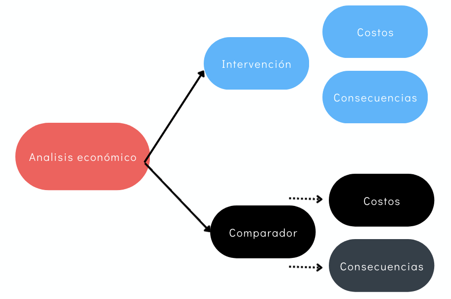

---
class: inverse, middle

# Practicidad

--

#### Ejemplo de evaluación económica

---
# Un ejemplo

--

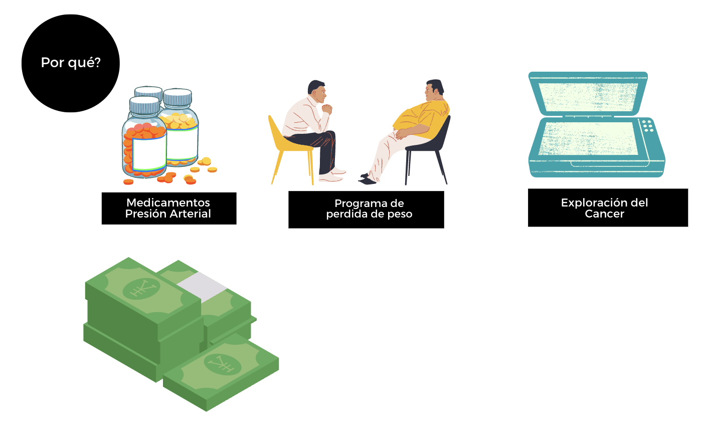

---
# Un ejemplo


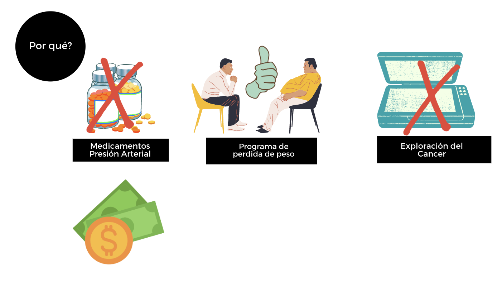

---
# Un ejemplo


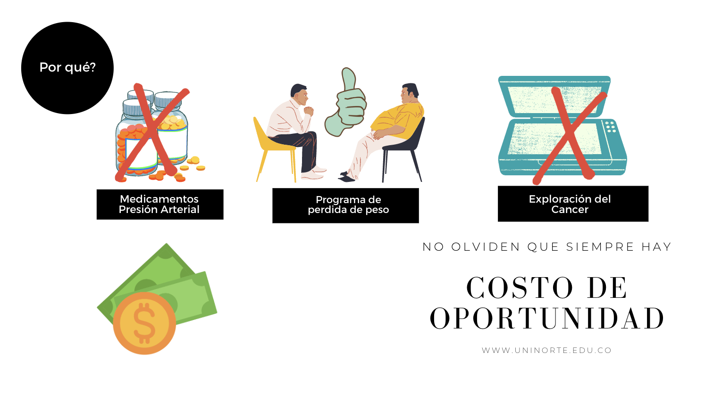

---
class: inverse, middle

# Practicidad

--

#### Tipos de evaluación económica

---
# De la evaluación económica

--

`r fa("check-square")` Minimización del costo

--

`r fa("check-square")` Costo efectividad

--

`r fa("check-square")` Costo utilidad

--

`r fa("check-square")` Costo Beneficio

--

El .RRed[análisis] *comparativo* es mirar la alternativa que en términos de **costos** y **consecuencias** mejoren las opciones de decisión.

--

+ Mirar siempre la **eficiencia**, **efectividad** y **disposición** de los distintos actores (stakeholders)

---
# De la evaluación económica

--

```{r, cost1, echo=FALSE}
mi_im <- data.frame(
  "A" = c("Costo minimización", "Costo efectividad","Costo utilidad", "Costo Beneficio"),
  "B" = c(" ", " ", " ", " "),
  "C" = c(" ", " ", " ", " "))

ft <- flextable(mi_im)
ft<-set_header_labels(ft, A = "Clasificación", B = "Costo", C="Resultados")
ft <- theme_vanilla(ft)
ft <- add_footer_lines(ft, "Fuente: Appuhamy & Clark (2021)")
ft <- color(ft, part = "footer", color = "#666666")
ft <- set_caption(ft, caption = "Tipos de costos")
ft
```

---

class: live-code

# Como funciona todo esto?...

--

+ Vamos por pasos 

--

## Minimizar costos

---
# Minimizar Costos

--

`r fa("angle-double-right", fill="blue")` Antes de nada, hablemos de los costos que vamos a enfrentar.

--

<md-blockquote>.RRed[Costos Directos]: Todos aquellos asociados a la intervención. P.e: *Personal de la salud, equipo de trabajo, transporte, logística.*</md-blockquote>

--

<md-blockquote>.RRed[Costos Indirectos]: Aquellos que no se asocian a la intervención. P.e: *Salarios perdidos por enfermedad (disposición), algunos arriendos.*</md-blockquote>

--

<md-blockquote>.RRed[Costos Intangibles]: Aquellos que es difícil de contabilizar y que afectan directa/indirectamente la intervención. P.e: *Dolor, sufrimiento, pena, etc.*</md-blockquote>

---
# Minimizar Costos: Aplicación

--

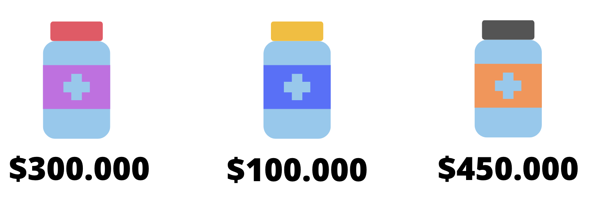


--

`r fa("check-circle", fill="red")` Podríamos simplemente escoger el de menor valor que nos ofrece la farmacéutica.

--

`r fa("check-circle", fill="red")` Algunas veces será la mejor oferta del momento y la forma de cuantificarlo es por el dinero gastado en él (tratamiento/medicamento).

---
# Minimizar Costos: Aplicación

--

```{r, cost2, echo=FALSE}
mi_im1 <- data.frame(
  "A" = c("Costo minimización", "Costo efectividad","Costo utilidad", "Costo Beneficio"),
  "B" = c("$ Pesos", " ", " ", " "),
  "C" = c("Mismo resultado", " ", " ", " "))

ft1 <- flextable(mi_im1)
ft1<-set_header_labels(ft1, A = "Clasificación", B = "Costo", C="Resultados")
ft1 <- theme_vanilla(ft1)
ft1 <- add_footer_lines(ft1, "Fuente: Appuhamy & Clark (2021)")
ft1 <- color(ft1, part = "footer", color = "#666666")
ft1 <- set_caption(ft1, caption = "Tipos de costos")
ft1
```

---
# Minimizar Costos: Aplicación

--

Un ejemplo relevante donde se busca **minimizar los costos** en una evaluación económica es al comparar dos tratamientos para hipertensión arterial. Supongamos que existen dos medicamentos 

`r fa("info-circle", fill="red")` .RRed[Medicamento A] (un fármaco de prescripción) y .hi-orange[Medicamento B] (una nueva droga más cara pero con un mejor perfil terapéutico).

--

La **evaluación económica** se enfoca en determinar cuál es la alternativa más rentable para el sistema sanitario, teniendo en cuenta no solo los costos directos de las fórmulas farmacéuticas sino también los posibles .hi-pink[ahorros generales] derivados de un mejor control de la hipertensión y una reducción del riesgo cardiovascular.

--

Los resultados podrían demostrar que si bien .hi-orange[Medicamento B] tiene un costo por uso mayor al del .RRed[medicamento A], en promedio reduce el **número total de hospitalizaciones** por complicaciones crónicas relacionadas con la hipertensión y los accidentes cerebrovasculares. Estos .hi-pink[ahorros generales] podrían compensar mejor que .hi-orange[Medicamento B] su costo inicial más alto.

---
# Minimizar Costos: Aplicación

--

> Por lo tanto, si se desea minimizar el costo económico en general para las personas afectadas por la hipertensión arterial y para los sistemas sanitarios públicos o privados involucrados, un análisis riguroso de este tipo podría llevar a recomendar Medicamento B como una opción más sostenible.

---

class: live-code

# Como funciona todo esto?...

--

+ Vamos por pasos 

--

## Costo efectividad

---
# Costo efectividad: Aplicación

--

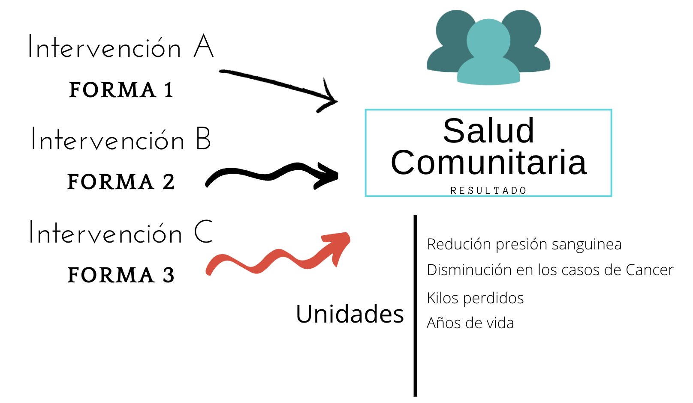

--

`r fa("check-circle", fill="red")` Las **unidades** son claves, es mas especifico y se requiere del grupo de especialistas para ir midiendo cada fase. 

---
# Costo efectividad: Aplicación

--

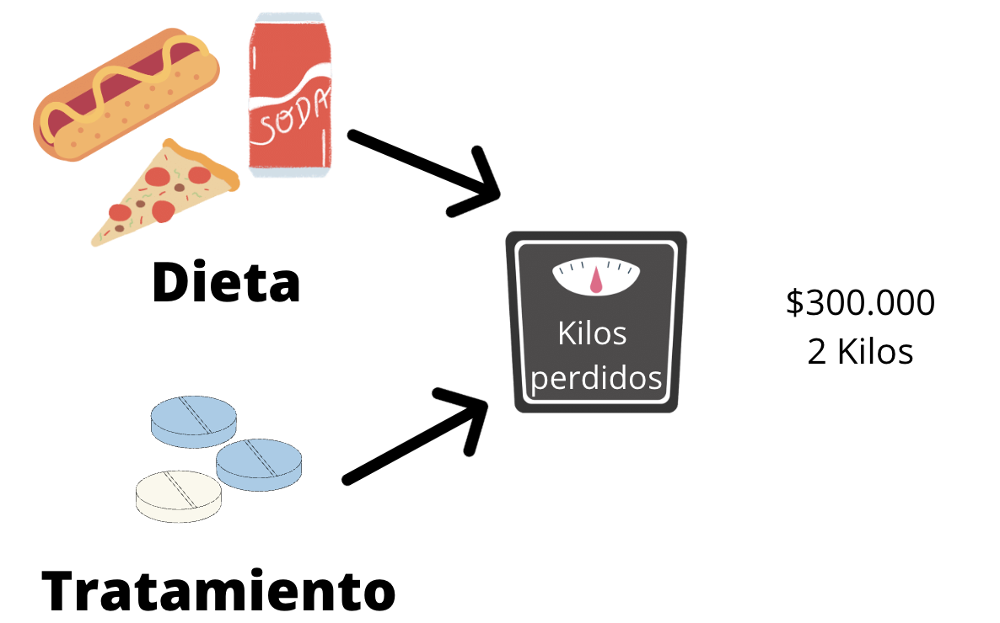


---
# Costo efectividad: Aplicación

--

`r fa("chess-bishop", fill="red")` Suponga que tenemos el programa de dieta, y esta consulta cuesta $300.000. Con la revisión de resultados vemos que el paciente pierde .RRed[2 Kilos], entonces tenemos:

--

<font size="+8"> $$300.000 \div 2= \$150000\; \text{Pesos por kilo}$$ </font>

--

Por otro lado, entonces si se le da el medicamento de valor de $450.000 pero el paciente pierde hasta 5 kilos, entonces:

--

<font size="+8"> $$450.000 \div 5= \$90000\; \text{Pesos por kilo}$$ </font>

--

.RRed[Se puede pensar] que la opción mejor **costo-efectiva** es esta última.

---
# Costo efectividad: Aplicación

--

```{r, cost3, echo=FALSE}
mi_im2 <- data.frame(
  "A" = c("Costo minimización", "Costo efectividad","Costo utilidad", "Costo Beneficio"),
  "B" = c("$ Pesos", "$ Pesos ", " ", " "),
  "C" = c("Mismo resultado", "Unidad Natural ", " ", " "))

ft1 <- flextable(mi_im2)
ft1<-set_header_labels(ft1, A = "Clasificación", B = "Costo", C="Resultados")
ft1 <- theme_vanilla(ft1)
ft1 <- add_footer_lines(ft1, "Fuente: Appuhamy & Clark (2021)")
ft1 <- color(ft1, part = "footer", color = "#666666")
ft1 <- set_caption(ft1, caption = "Tipos de costos")
ft1
```

---
# Costo efectividad: Aplicación

--

`r fa("bell", fill="red")` Caso: **Vacunación contra el Virus del Papiloma Humano (VPH)**

--

.hi-pink[Contexto]: El Virus del Papiloma Humano (VPH) es una de las infecciones de *transmisión sexual* más comunes y está asociado con varios tipos de cáncer, incluyendo el cáncer de cuello uterino.

--

### Intervenciones Comparadas:

- Vacunación contra el VPH para niñas de 12 años.
- No vacunación y seguimiento con pruebas de detección regulares.

--

.RRed[Costos Considerados]:

- Vacunación: Costo de las dosis de la vacuna, administración, y campañas de concientizacion.
- No vacunación: Costo de las pruebas de detección, tratamiento de lesiones precancerosas y cáncer, y seguimiento médico.
---
# Costo efectividad: Aplicación

--

.hi-slate[Efectividad Medida] 😬:

- Vacunación: Reducción en la incidencia de infecciones por VPH y cáncer de cuello uterino.
- No vacunación: Incidencia de infecciones por VPH y cáncer de cuello uterino sin intervención preventiva.

--

### Resultados del Estudio:

- Costo de la Vacunación: $100 por niña vacunada.
- Costo del No Vacunación: $200 por paciente tratada por cáncer de cuello uterino.

--

`r fa("long-arrow-alt-right", fill="red")` **Efectividad**: La vacunación reduce la incidencia de cáncer de cuello uterino en un 70%.

---
class: live-code

# Como funciona todo esto?...

--

## Costo utilidad

---
# Costo utilidad

--
<center>
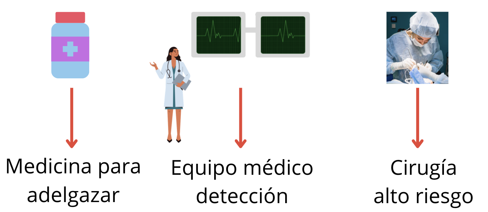
</center>
--

`r fa("chess-rook", fill="red")` Debemos mirar en una unidad común de medida.

--

> (QALY): Años de vida ajustados por calidad

--

Es la unidad de utilidad aplicada a la valoración de alternativas.

--

<font size="+3">$$QALY: \;\text{Años de vida ganados} \times \; \text{Calidad de vida}$$</font>

---
# Costo utilidad

--
<center>
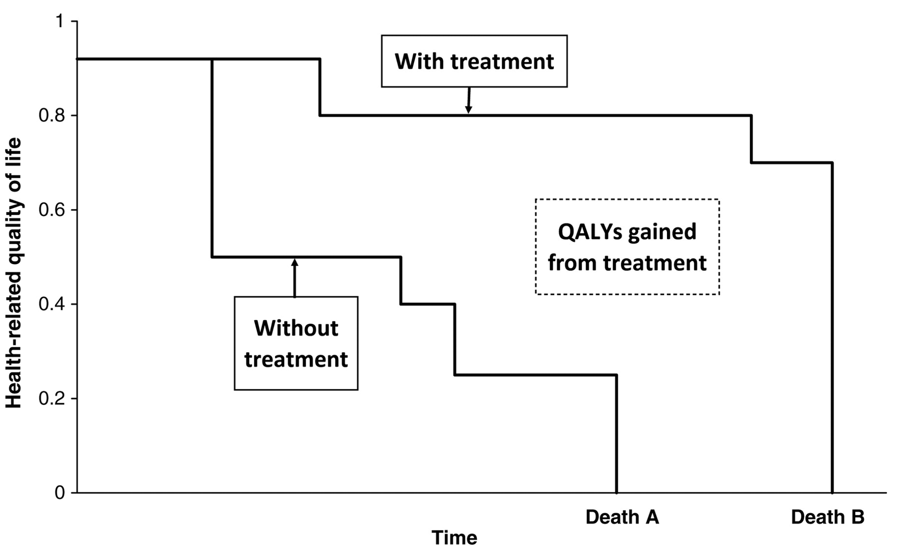
Fuente: Whitehead & Ali (2010)
</center>
--

En alguna ocasión de nuestras vidas podemos enfrentar un tipo de eventualidad.

--

El criterio de .RRed[QALY] está en un intervalo entre 0 y 1.

--

$$\begin{aligned}
QUALY: 0 & \quad \text{Lo peor}\\
QUALY: 1 & \quad \text{Lo mejor}
\end{aligned}$$

---
# Costo utilidad: Aplicación

--

`r fa("chess-bishop", fill="red")` Tenemos un tratamiento establecido a una persona (paciente) y se ha extendido su vida por .RRed[5] años mas.

--

$$\begin{aligned}
\text{QUALY} \; A: (0.2)\; \text{calidad de vida} \times & \text{años ganados}\; (5) = 1\\
\text{QUALY} \; B: (1)\; \text{calidad de vida} \times & \text{años ganados}\; (5) =5
\end{aligned}$$

--

La intervención B es mejor .RRed[Costo-utilidad] que la intervención de A.

--

`r fa("child", fill="red")` La calidad de vida puede medirse de varias maneras o formas:

--

+ Cuestionario SF36

--

+ EuroQol-5D

---
# Costo utilidad: Aplicación

--

### Otros ejemplos con QALY:

- Un año en perfecto estado de salud: 1 año × 1 (utilidad) = 1 QALY.
- Un año con una enfermedad crónica: 1 año × 0.5 (utilidad) = 0.5 QALYs.
- Medio año en perfecto estado de salud: 0.5 años × 1 (utilidad) = 0.5 QALYs.

--

El .hi-pink[QALY] se utiliza para comparar la **efectividad** de diferentes intervenciones médicas y ayudar a los responsables de políticas de salud a tomar decisiones informadas sobre la asignación de recursos. Por ejemplo, si una intervención cuesta `$10,000` y proporciona 2 QALYs, el costo por QALY sería `$5,000`. Este valor se puede comparar con otras intervenciones para determinar cuál ofrece mejor relación .hi-orange[costo-efectividad].

---
# Costo utilidad: Aplicación

--


_Recordemos el casod de vacunación para VPH_: Costo por Año de Vida Ajustado por Calidad (QALY) Ganado: La vacunación tiene un costo de `$1,000` por QALY ganado, mientras que el no vacunación tiene un costo de `$5,000` por QALY ganado.

--

En conclusión: La vacunación contra el VPH es más .hi-pink[costo-utilidad] que no vacunar, ya que reduce significativamente la incidencia de cáncer de cuello uterino y los costos asociados a su tratamiento.


---
# Costo utilidad: Aplicación

--

```{r, cost4, echo=FALSE}
mi_im3 <- data.frame(
  "A" = c("Costo minimización", "Costo efectividad","Costo utilidad", "Costo Beneficio"),
  "B" = c("$ Pesos", "$ Pesos ", "$ Pesos ", " "),
  "C" = c("Mismo resultado", "Unidad Natural ", "Medida (QUALY) ", " "))

ft2 <- flextable(mi_im3)
ft2<-set_header_labels(ft2, A = "Clasificación", B = "Costo", C="Resultados")
ft2 <- theme_vanilla(ft2)
ft2 <- add_footer_lines(ft2, "Fuente: Appuhamy & Clark (2021)")
ft2 <- color(ft2, part = "footer", color = "#666666")
ft2 <- set_caption(ft2, caption = "Tipos de costos")
ft2
```
---
class: live-code

# Como funciona todo esto?...

--

## Costo beneficio

---
# Costo beneficio

--
<center>
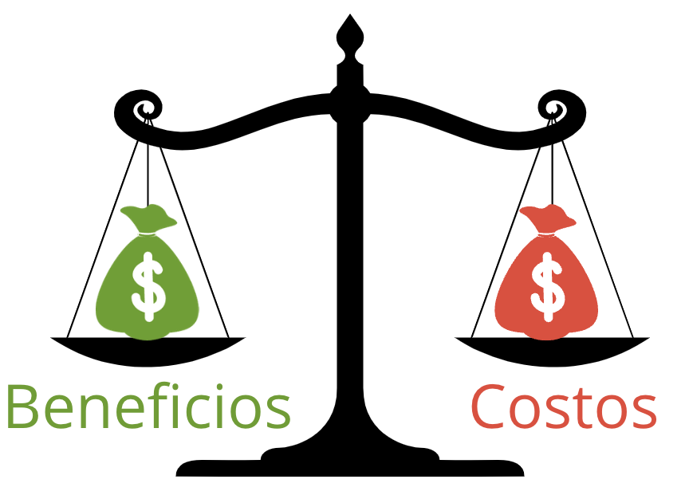
</center>
--

`r fa("chess-rook", fill="red")` Es mucho mas compleja. Requiere de múltiples enfoques, entre ellos (información a medida, background teórico, entre otros).

---
# Costo beneficio

--

> Disponibilidad a pagar y capital humano son las herramientas a cuantificar.

--

Dentro de .RRed[Disponibilidad a pagar] se encuentra *beneficios del tratamiento* como también *costo de evadir una enfermedad*

--

Para la parte de .RRed[Capital Humano] se tiene en cuenta lo que es *perdida o ganancia de ingresos debido a la enfermedad*

--

Hay que enmarcar la posibilidad de la aleatorización de los pacientes que serán tratados y aquellos que seran debidamente controles o grupos de comparación.

---
# Costo beneficio

--

### Definición del Problema y Objetivos:

- Identificar claramente el .hi-pink[problema de salud] que se desea abordar y los objetivos de la *intervención*.

--

`r fa("info-circle", fill="red")` Identificación de Alternativas:

--

- Hacer una lista de todas las .hi-slate[posibles intervenciones] o tratamientos que podrían abordar el problema.

--

`r fa("info-circle", fill="red")` Medición de Costos:

--

- Costos Directos: Gastos en bienes y servicios directamente relacionados con la intervención (e.g., medicamentos, hospitalización).
- Costos Indirectos: Pérdidas de productividad debido a la enfermedad o tratamiento (e.g., días de trabajo perdidos).
- Costos Intangibles: Impacto en la calidad de vida (e.g., dolor y sufrimiento).

---
# Costo beneficio: Aplicación

--

`r fa("mug-hot", fill="blue")` Medición de Beneficios:

--

- **Beneficios Directos**: Reducción de costos médicos futuros debido a la intervención (e.g., menos hospitalizaciones).
- **Beneficios Indirectos**: Incremento en la productividad debido a la mejora en la salud (e.g., más días de trabajo).
- **Beneficios Intangibles**: Mejora en la calidad de vida (e.g., menos dolor y sufrimiento).

--

`r fa("chess-rook", fill="red")` Descuento de Costos y Beneficios:

- Ajustar los .RRed[costos] y .hi-slate[beneficios futuros] a su valor presente utilizando una **tasa de descuento**, ya que el valor del dinero cambia con el tiempo.

--

`r fa("chess-rook", fill="blue")` Cálculo del Cociente Beneficio-Costo (BCR):

- Dividir el **valor presente** de los beneficios por el valor presente de los costos. Un BCR mayor a 1 indica que los beneficios superan los costos.


---
# Costo beneficio: Aplicación

--

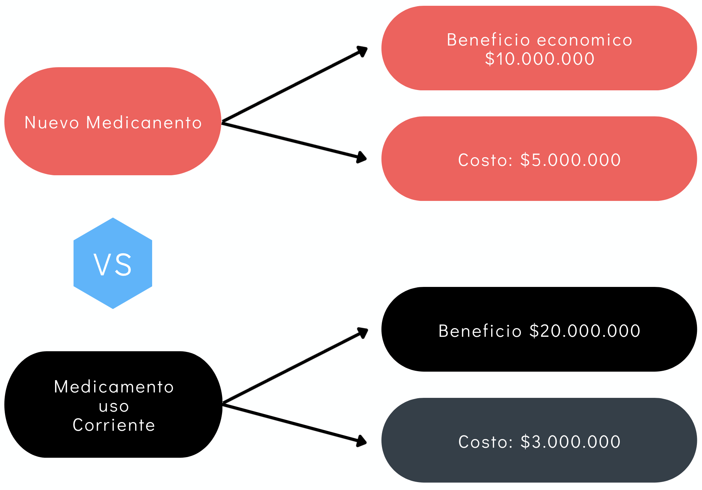


---
# Costo beneficio: Aplicación

--

```{r, cost5, echo=FALSE}
mi_im5 <- data.frame(
  "A" = c("Costo minimización", "Costo efectividad","Costo utilidad", "Costo Beneficio"),
  "B" = c("$ Pesos", "$ Pesos ", "$ Pesos ", " $ Pesos "),
  "C" = c("Mismo resultado", "Unidad Natural ", "Medida (QUALY) ", " $ Pesos "))

ft3 <- flextable(mi_im5)
ft3<-set_header_labels(ft3, A = "Clasificación", B = "Costo", C="Resultados")
ft3 <- theme_vanilla(ft3)
ft3 <- add_footer_lines(ft3, "Fuente: Appuhamy & Clark (2021)")
ft3 <- color(ft3, part = "footer", color = "#666666")
ft3 <- set_caption(ft3, caption = "Tipos de costos")
ft3
```

---
# Costo beneficio: Aplicación

--

`r fa("bell", fill="red")` Caso: **Implementación de un Programa de Ejercicio para Personas con Diabetes Tipo 2**

--

`r fa("long-arrow-alt-right", fill="red")` Problema y Objetivos:

- Reducir las complicaciones de la diabetes tipo 2 mediante un programa de ejercicio regular.

--

### Alternativas:

--

- Programa de ejercicio supervisado.
- No intervención (grupo de control).

--

.RRed[Costos]:
- Directos: $500 por persona para el programa de ejercicio (entrenadores, instalaciones).
- Indirectos: $200 por persona en tiempo perdido de trabajo.
- Intangibles: No aplicable en este caso.

---
# Costo beneficio: Aplicación

--

`r fa("mug-hot", fill="blue")` .hi-slate[Beneficios]:
- Directos: Ahorro de $1,000 por persona en costos médicos futuros (menos hospitalizaciones y medicamentos).
- Indirectos: Incremento de $300 por persona en productividad (menos días de trabajo perdidos).
- Intangibles: Mejora en la calidad de vida valorada en $200 por persona.

-- 

.hi-pink[Descuento]: Supongamos una tasa de descuento del 3% anual para ajustar los valores futuros.

---
# Costo beneficio: Aplicación

--

`r fa("fighter-jet", fill="blue")`  .hi-orange[Cálculo del BCR]:

- Beneficios totales: `$1,000` (directos) + `$300` (indirectos) + `$200` (intangibles) = $1,500.

- Costos totales: `$500` (directos) + `$200` (indirectos) = $700.

--

BCR = `$1,500` / `$700` ≈ 2.14.

En este *ejemplo*, el .hi-pink[programa de ejercicio] tiene un BCR de 2.14, lo que significa que por cada dólar invertido, se obtienen $2.14 en beneficios. Esto indica que el programa es económicamente viable y beneficioso

---
# Costo beneficio: Aplicación

--

Supongamos que esperas recibir $1,000 en 3 años y la tasa de descuento es del 3% anual. Para calcular el valor presente, usarías la fórmula de la siguiente manera:

$$VP=\dfrac{1000}{(1+0.03)^{3}} \approx 915.14$$

--

Esto significa que `$1,000` recibidos en 3 años tienen un valor presente de aproximadamente `$915.84` hoy, si la tasa de descuento es del 3%.


---
class: live-code

# Qué falta?...

--

## Solo unos detalles...

---
# Etapas de la evaluación

--

1. Plantear el requerimiento / servicio a proveer

--

1. Identificar todos los costos de implementación y métricas

--

1. Ajustar tiempos

--

1. Ajustes de incertidumbre

--

1. .RRed[Tomar la decisión]

---
class: your-turn

# <i class="fas fa-cloud"></i>

## Actividad Pre-Final: dirijase a

<https://www.socrative.com/>

### Siga las siguientes instrucciones:

1. Ingrese como estudiante

2. Coloque su nombre completo

3. Responda cada una de las preguntas

```{r echo = FALSE}
countdown(minutes = 15, update_every = 20)
```


---
# Bibliografía

`r fa('book')` Whitehead Sarah J., &  Ali S. , Health outcomes in economic evaluation: the QALY and utilities, British Medical Bulletin, Volume 96, Issue 1, December 2010, Pages 5–21,

`r fa('book')` Cabasés, J. M., & Oliva, J. (2011). El gobierno de la sanidad frente a la crisis económica. Notas sobre economía de la salud y sostenibilidad del sistema sanitario. Cuadernos de información económica, 225, 57-62.

`r fa('book')`Phelps, C. E. (2017). Health economics. Routledge.

`r fa('book')` Notas de Health economics from Ranil Appuhamy & Anitha Appuhamy.

`r fa('book')` Notas de clase de Health economics Smith & Wright 

---
class: your-turn

## Gracias por su atención!

### Alguna pregunta adicional?

#### Carlos Andres Yanes Guerra
`r fa("envelope", fill="red")` cayanes@uninorte.edu.co
`r fa("twitter", fill="cyan")` keynes37


