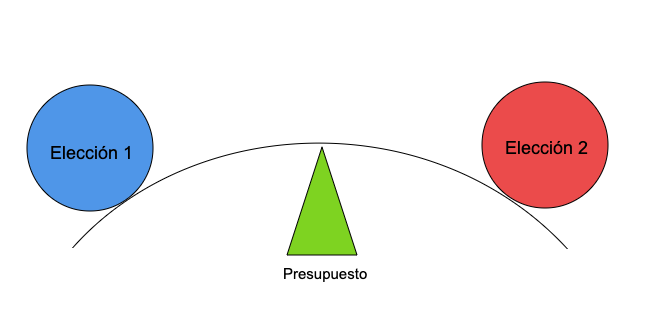
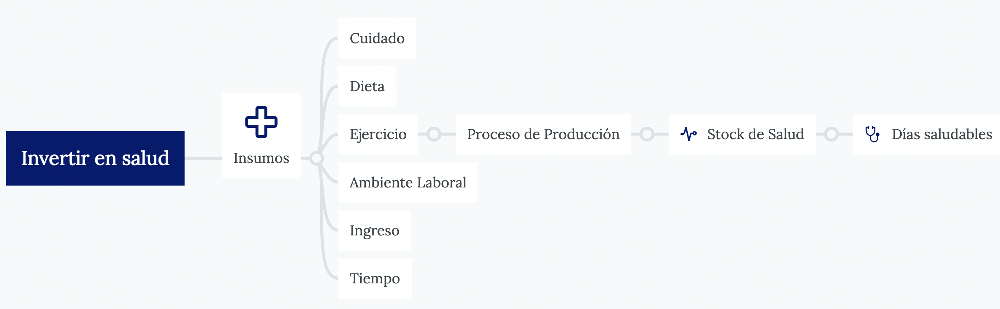
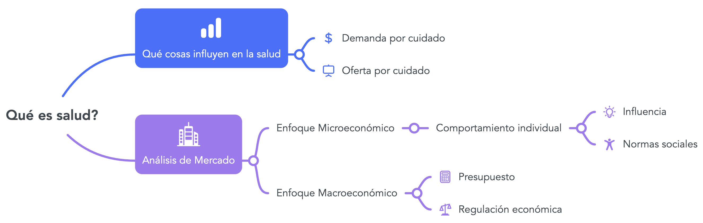

```{r setup, include=FALSE}
options(htmltools.dir.version = FALSE)
```

```{r packages, include=FALSE}
library(pacman)
p_load(broom, latex2exp, ggplot2, ggthemes, ggforce, viridis, dplyr, magrittr, knitr, parallel, flextable, xaringanExtra, tidyverse, emo, fontawesome, datos, babynames, treemapify, shiny, kableExtra, plotly, econocharts, hrbrthemes, DiagrammeR, countdown, readxl, janitor, gapminder, Ecdat, wooldridge, dslabs, extrafont)

# Define colors
red_pink <- "#e64173"
met_slate <- "#272822" # metropolis font color 
purple <- "#9370DB"
green <- "#007935"
light_green <- "#7DBA97"
orange <- "#FD5F00"
turquoise <- "#44C1C4"
# Notes directory
dir_cap<- "~/Users/carlosandresyanesguerra/Documents/Trabajo en R/Con Mac/HealthEconomics/economicsofhealth"
# Knitr options
opts_chunk$set(
  comment = "#>",
  fig.align = "center",
  fig.height = 7,
  fig.width = 10.5,
  #dpi = 300,
  #cache = T,
  warning = F,
  message = F
)  
theme_simple <- theme_bw() + theme(
  axis.line = element_line(color = met_slate),
  panel.grid = element_blank(),
  rect = element_blank(),
  strip.text = element_blank(),
  text = element_text(family = "Fira Sans", color = met_slate, size = 17),
  axis.text.x = element_text(size = 12),
  axis.text.y = element_text(size = 12),
  axis.ticks = element_blank()
)
theme_gif <- theme_bw() + theme(
  axis.line = element_line(color = met_slate),
  panel.grid = element_blank(),
  rect = element_blank(),
  text = element_text(family = "Fira Sans", color = met_slate, size = 17),
  axis.text.x = element_text(size = 12),
  axis.text.y = element_text(size = 12),
  axis.ticks = element_blank()
)
wrapper <- function(x, ...) paste(strwrap(x, ...), collapse = "\n")
```


class: title-slide, center, middle

<span class="fa-stack fa-4x">
  <i class="fa fa-circle fa-stack-2x" style="color: #ffffffcc;"></i>
  <strong class="fa-stack-1x" style="color:#3b4245;">Go!</strong>
</span> 

# `r rmarkdown::metadata$title`

## `r rmarkdown::metadata$subtitle`

### `r rmarkdown::metadata$author` &#183; Data science

#### [https://carlosyanes.netlify.app/](https://carlosyanes.netlify.app/)

---
class: right, middle

# Yo

`Profesor<-c('Carlos A. Yanes')` 
`r fa('address-book')` [Carlos Andrés Yanes Guerra](https://www.linkedin.com/in/carlos-andres-yanes-guerra-0026bb31/?originalSubdomain=co)

`r fa('envelope')` [cayanes@uninorte.edu.co](mailto:cayanes@uninorte.edu.co)

`r fa('github')` [Github](https://github.com/keynes37)

`r fa('twitter')` [keynes37](https://twitter.com/keynes37)

`r fa('graduation-cap')` Profesor Asistente (Introducción a la Economía, Econometría y Microeconomía) en el Departamento de Economía ubicado en **Bloque D**.


---
class: middle, center

# <i class="fas fa-cloud"></i>

# Recuerde que los elementos del curso estarán en:

<https://carlosyanes.netlify.app/health>

---
# Respecto a notas y actividades

--

```{r table01, echo=FALSE}
library(kableExtra)
text_tbl <- data.frame(
  Items = c("Participación Activa", "Preguntas Interactivas", "Tareitas","Lectura recomendada", "Trabajo Final"),
  Condicion = c(
    "En las sesiones",
    "Mitad de jornada",
    "Hasta la siguiente semana", 
    "Inter-sesiones",
    "Semana Final"
  ),
  Porcentaje = c ("20%","10%","20%","20%", "30%")
)

kbl(text_tbl) %>%
  kable_paper(full_width = F) %>%
  column_spec(1, bold = T, color = "black", border_right = T) %>%
  column_spec(2, width = "30em", background = "yellow") %>%
  column_spec(3, bold = F, color = "black", border_left = T)
```


---

class: middle, center

| Hora          | Actividad                               |
|:--------------|:----------------------------------------|
| 14:00 - 14:15 | Presentación participantes              |
| 14:15 - 15:50 | Sesión 1 (Introducción)                 |
| 15:50 - 16:05 | *Break* `r emo::ji("coffee")`           |
| 16:05 - 16:45 | Sesión 2 (Actividad 1)                  |
| 16:45 - 17:15 | Discusión (Actividad 1)                 |
| 17:15 - 17:30 | *Break* `r emo::ji("tea")`              |
| 17:30 - 18:00 | Sesión 3 (Contextualizando)             |

---
class: middle, center

# <i class="fas fa-home"></i>

## Lo importante de la sesión siempre es aprender

### Pregunte todo lo que le parezca extraño

---
layout: true

<div class="my-footer"><span>Economía de la Salud | CAYG | www.uninorte.edu.co </span></div>


---
# Empecemos

--

"... _En la economía de la salud, cada decisión de política no solo afecta los costos y la eficiencia, sino que también tiene un impacto profundo en la calidad de vida y el bienestar de las personas. Es un campo donde la economía se encuentra con la ética, y donde las cifras se convierten en historias humanas...._ " 

.RRed[Carlos Yanes], .lightgrey[Construyendo un espacio de discusión], Febrero 2025. 

---
# Intentamos aprender

--

1. Qué es economía?

--

1. Qué .RRed[NO] es la .blue[economía]

--

1. Qué es ".blue[Salud]" (bienestar)

--

1. Qué es economía de la .blue[Salud]?

--

#### Conceptos claves en economía

--

- Costo de oportunidad

--

- Eficiencia

---
# Economía como ciencia trata con...

--

.pull-left[
+ Recursos .RRed[limitados]

+ `Necesidades` ilimitadas

+ Escoger "lo mejor" para 🤗 dada una restricción 💵
]

.pull-right[
 
]

---
# Según un economista 

--

Siguiendo a .pink[John Maynard Keynes]:

--

> La **teoría económica** no proporciona un conjunto de conclusiones definitivas aplicables inmediatamente a la política. Es un .blue[método] más que una doctrina, un aparato mental, una *técnica* de pensamiento que ayuda a su poseedor a extraer conclusiones correctas.

--

### Esto nos da una idea de porqué estudiar economía

--

+ Desarrollar las habilidades de pensamiento crítico que valoran los empresarios.

+ Cultivar un sano escepticismo.

+ Aprender a navegar por un conjunto diverso de cuestiones relevantes para la política.


---
# A modo general

--

+ Qué es **economía**?

--

<ru-blockquote>
Una ciencia social que estudia las decisiones individuales y grupales que se encuentran en un ambiente de escasez y de necesidades ilimitadas.</ru-blockquote>

--

+ Qué es **economía de la salud**

--

<md-blockquote>Una rama especializada de la economía que tiene que ver con el estudio de costos, beneficios, localización de recursos, insumos, resultados que tienen que ver con el cuidado de la salud</md-blockquote>

--

+ Dónde surgió esto de economía de la salud?

--

`r fa('caret-right')` Inicio del siglo XX con el AMA Bureau of medical economics. Ademas de .RRed[Milton Friedman] (Premio Nobel en economía) quien miraba la elección optima de recursos. .RRed[Kenneth Arrow] 1963: Uncertainty and the welfare economics of medical care.

---
# Micro vs Macro

--

La .blue[microeconomía] se centra en las causas y consecuencias de las decisiones en una economía de mercado.

--

#### Responde a:

--

¿Qué factores limitan las decisiones de los individuos? ¿Cómo responden
¿Cómo responde la gente cuando relajamos esas restricciones o imponemos otras nuevas? ¿Nos nos gustan las consecuencias?

--

La .RUred[macroeconomía] se centra en el comportamiento de economías enteras y 
mas completas.

--

#### Responde a:

--

¿Cómo hacemos crecer la economía y evitamos las recesiones?

---
class: clear-slide

.center[**Un poco de historia**]

```{R, echo = FALSE, fig.height = 4.75, dev = "svg"}

gdp <- read_csv("gdp_global.csv") %>% 
  clean_names() %>% 
  rename(gdp = real_gdp_per_capita_in_2011_us) %>% 
  filter(entity %in% c("United Kingdom", "United States", "China", "India", "Egypt"),
         year >= 1000)
ggplot(gdp, aes(x = year, y = gdp, color = entity)) +
  geom_line(size = 1) +
  scale_y_continuous(expand = c(0, 0)) +
  expand_limits(y = 0) +
  labs(color = "",
       caption = "Fuente: Our World in Data",
       x = "", 
       y = "PIB Real por persona (2011 US dollars)") +
  scale_color_brewer(palette = "Dark2") +
  theme_simple
```

---
class: clear-slide
.center[]

---
# Economía es todo sobre elección

--

```{r echo = FALSE}

```
---
class: inverse, middle

# Concepto Clave 1

--

#### Costo de oportunidad

---
# Costo de oportunidad

--

<md-blockquote>El valor del beneficio perdido que podría obtenerse de un recurso en su siguiente mejor uso alternativo</md-blockquote>

--

**Cuidado Pediatra**|**Cuidado Geriátrico**|**Costo de Oportunidad**
:-----:|:-----:|:-----:
0|30|0
1|28|2
2|18|12
3|14|16
4|10|20
5|0|30

---
# Costo de oportunidad

--

```{r datamed1, include=FALSE}
p <- ppf(x = 4:6, # Intersections
         main = "Frontera de posibilidades",
         geom = "text",
         generic = TRUE, # Generic labels
         labels = c("A", "B", "C"), # Custom labels
         xlab = "Cuidado Pediatrico",
         ylab = "Cuidado Geriatrico",
         acol = 3)      # Color of the area
```

```{r, ex1, echo=FALSE}
p$p + geom_point(data = data.frame(x = 5, y = 5), size = 5) +
  geom_point(data = data.frame(x = 2, y = 2), size = 5) +
  annotate("segment", x = 3.1, xend = 4.25, y = 5, yend = 5,
           arrow = arrow(length = unit(0.5, "lines")), colour = 3, lwd = 1) +
  annotate("segment", x = 4.25, xend = 4.25, y = 5, yend = 4,
           arrow = arrow(length = unit(0.5, "lines")), colour = 3, lwd = 1)
```

---
# Costo de oportunidad

--

`r fa('caret-right', fill="red")` Decidir hacer .blue[A] implica la decisión de NO hacer .blue[B]. (P.e los beneficios de $A>B$)

--

`r fa('caret-right', fill="red")` Los costos ocurren sin necesidad de incurrir en gastos _financieros_.

--

`r fa('caret-right', fill="red")` El "valor" no necesariamente es determinado por el .RRed[Mercado].


---
# La forma en como los economistas ven el mundo

.pull-left[]

.pull-right[`r fa("bacterium", fill="blue")` .lightgrey[Pesimista]: Media botella vacia

`r fa("bacterium", fill="blue")` .lightgrey[Optimista]: Media botella llena

`r fa("bacterium", fill="blue")` .RRed[Economista]: Media botella desperdiciada

<br>
<br>
Eso es ineficiente!!]

---
class: live-code

# Piense esto:

<br>
<br>

### Cuál es el costo de oportunidad que tiene una IPS de camas UCI en comparación de camas de hospitalización?

---
# Respuesta

--

El .RRed[costo de oportunidad] es el valor de la **mejor alternativa** no elegida. En este caso, es el beneficio que se pierde al elegir asignar recursos a una cama UCI en lugar de una cama de hospitalización general.

--


- Si la IPS decide asignar recursos a una cama UCI, el costo diario es de $2,373,400 COP.

- Si la IPS decide asignar recursos a una cama de hospitalización general, el costo diario es de $1,000,000 COP.

--

> La diferencia en costos es $1,373,400 COP por día.

--

La IPS debe considerar tanto los .RRed[costos] como los **beneficios** de cada tipo de cama. Si la demanda de camas UCI es extremadamente **alta** y las vidas de los pacientes están en riesgo, puede ser justificable asignar más recursos a las camas UCI a pesar del mayor costo. Sin embargo, si la demanda de hospitalización general es alta y puede prevenir complicaciones futuras, asignar recursos a camas de hospitalización general puede ser más eficiente a largo plazo.


---
class: middle, center

# `r emo::ji("stopwatch")`

# Es hora de un break!

```{r echo = FALSE}
countdown(minutes = 10, update_every = 15)
```

---
class: your-turn

# <i class="fas fa-cloud"></i>

## Actividad 1: Revise el siguiente enlace

<https://www.youtube.com/watch?v=yiNfSOTLskw>

### Intente responder:

a. Cuál es el mensaje principal que le deja el presentador?

b. Qué eventos similares ha experimentado?

c. Como lo aplicaría a la solución de un problema de su área de trabajo?

```{r echo = FALSE}
countdown(minutes = 30, update_every = 35)
```

---
class: inverse, middle

# Concepto Clave 2

--

#### Eficiencia

---
# Eficiencia

--

> Va con el uso, que tan bien se hace uso de los recursos excasos y maximizo una función de bienestar.

--

`r fa("rocket", fill="red")` .RRed[Eficiencia Técnica] Se alcanza un objetivo a un menor "Costo".

--

`r fa("rocket", fill="red")` .RRed[Eficiencia por Asignación] Cuando la oferta iguala a la **demanda**. Las necesidades de los pacientes son cubiertas por los servicios prestados por todo el sistema de salud.

--

*Recuerde que*:

--

.RRed[La eficacia] hace referencia a la obtención de los resultados propuestos en condiciones ideales, sin considerar los recursos empleados para ello, es decir, secentra en la consecución del **objetivo**.

--

La .RRed[eficiencia] es un concepto relativo que se obtiene por comparación con otras **alternativas** disponibles sobre la acción tomada, considerando los recursos empleados en la consecución de los resultados. Así pues, se trata de un **concepto económico** que viene justificado por la escasez 
de los recursos, susceptibles de otros usos alternativos.

---
# Tópicos vs Disciplina

--

`r fa("plane", fill="blue")` Tópico $\rightarrow$ área de estudio

--

`r fa("plane", fill="red")` Disciplina $\rightarrow$ Marco conceptual

--

> Economía de la salud es la disciplina (rama) de la economía aplicada a los tópicos de salud.

---
# Algunas ideas erroneas

--

### La economía es...

--

+ Todo lo que tiene que ver con dinero

--

+ Lo mismo que contabilidad

--

+ Solo es practicada por los economistas

--

+ Objetiva

---
# De lo que trata la economía

--

### Economía en cambio si es:

--

`r fa('flask')` Optimización

--

`r fa('flask')` Eficiencia

--

`r fa('flask')` Elección

--

`r fa('flask')` Bienestar

--

### Dinero... 💰

--

+ Deposito de valor

--

+ Medio de intercambio


---
# Qué entonces es salud?

--

La .RRed[Organización Mundial de la Salud] (OMS) la define como un estado de `bienestar` con características que van desde lo físico (movilidad), lo psicológico (mental) y otras consideraciones mas.

--

+ Usualmente ese estado de .grey[salud] va relacionado con una medición o métrica, hay que hacer eso de la _evaluación_ 

---
# Qué entonces es salud?


```{r bte1, echo=FALSE}

```


---
# Qué entonces es salud?

--

```{r bt1, echo=FALSE}

```


---
class: middle, center
# Un ejemplo de ese estado

--

`r emo::ji("heavy_check_mark")` **Movilidad:** Como considera que se siente? tiene alguna discapacidad motriz?

--

`r emo::ji("heavy_check_mark")` **Autocuidado:** Cuando fue la última vez que se automedico? Por qué lo hizo? 

--

`r emo::ji("heavy_check_mark")` **Actividades cotidianas** Qué hace regularmente en su trabajo? hace deporte? cuantas horas a la semana lo hace?

--

`r emo::ji("heavy_check_mark")` **Dolor/ inconformidad:** ha presentado algún dolor en la última semana?

--

`r emo::ji("heavy_check_mark")` **Ansiedad:** Ha tenido algún evento que ha padecido un episodio de ansiedad no controlada?

---
# Bibliografía

`r fa('book')` Notas de clase de Health economics Smith & Wright 

`r fa('book')` Cantarero, D., Lanza, P., & Lera, J. (2020). Juan Oliva Moreno, Beatriz González López-Valcárcel, Marta Trapero Bertrán, Álvaro Hidalgo Vega y Juan E. del Llano Señarís. Economía de la salud. Madrid: Pirámide; 2018. 444 p. ISBN: 978-84-368-3977-7. Gaceta Sanitaria, 34, 98-98.

`r fa('book')` Cabasés, J. M., & Oliva, J. (2011). El gobierno de la sanidad frente a la crisis económica. Notas sobre economía de la salud y sostenibilidad del sistema sanitario. Cuadernos de información económica, 225, 57-62.

`r fa('book')`Phelps, C. E. (2017). Health economics. Routledge.

---
class: your-turn

## Gracias por su atención!

### Alguna pregunta adicional?

#### Carlos Andres Yanes Guerra
`r fa("envelope", fill="red")` cayanes@uninorte.edu.co
`r fa("twitter", fill="cyan")` keynes37


